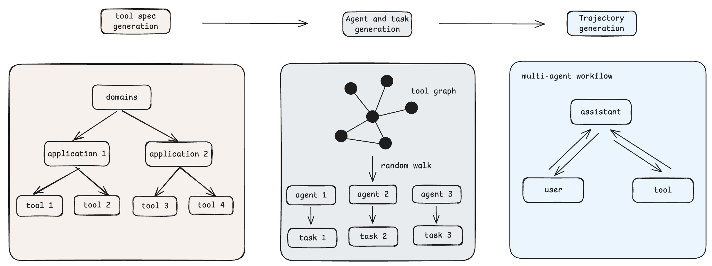
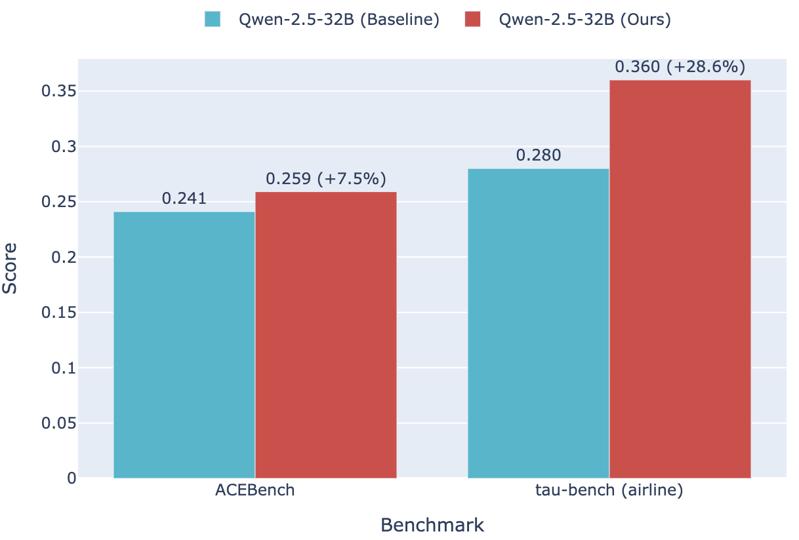

# AgenticGen: 多智能体数据合成系统

基于大语言模型的多智能体数据合成系统，用于自动生成高质量的智能体训练数据。通过模拟真实的多轮对话场景，实现大规模多样化智能体交互轨迹的自动化生成。



## 项目概述

AgenticGen 是一个完整的数据合成流水线，旨在解决智能体训练数据稀缺的问题。系统通过六个核心步骤自动化生成高质量的训练数据：

1. **场景生成** - 基于预定义领域生成多样化应用场景
2. **工具设计** - 为每个场景设计专用工具集
3. **智能体合成** - 组合系统提示词和工具集生成多样化智能体
4. **任务生成** - 为每个智能体生成不同难度级别的任务
5. **轨迹生成** - 模拟用户与智能体的多轮交互
6. **质量评估** - 基于评分标准筛选高质量轨迹

## 核心特性

- **多样化生成** - 支持多种场景、工具、智能体和用户人格的组合
- **高并发处理** - 支持多线程并发生成，提高数据生成效率
- **质量控制** - 内置质量评估机制，确保生成数据的高质量
- **可扩展性** - 支持自定义场景、工具和评估标准

## 应用场景

1. **通用智能体数据生成** - 基于预定义领域生成多样化场景和工具，合成多轮交互轨迹
2. **垂直领域数据生成** - 针对特定垂直场景，生成符合领域要求的工具集和交互轨迹
3. **现有工具集扩展** - 基于已有工具集生成包含这些工具的多轮对话轨迹

## 🛠️ 安装与配置

### 安装步骤

1. **克隆项目**
```bash
git clone <repository-url>
cd agent_data_gen
```

2. **安装依赖**
```bash
pip install -r requirements.txt
```

3. **配置环境变量**

复制 `.env.template` 创建 `.env` 文件：

```bash
# LLM 配置
OPENAI_API_KEY=your_openai_api_key
OPENAI_BASE_URL=https://api.openai.com/v1
OPENAI_MODEL=gpt-4
OPENAI_TEMPERATURE=0.7
DEFAULT_LLM_PROVIDER=openai
```

## 快速开始

系统采用模块化设计，支持完整流水线执行或单独模块运行。建议按以下顺序执行：

### 1. 场景生成

基于预定义领域生成详细的应用场景描述。首先在 `config/settings.py` 中配置目标领域：

```python
self.GENERATION_CONFIG = {
    "scenarios": {
        # you can add more domains here
        "domains": [
            "food_delivery",
            "robot_control",
            "social_media",
            "ecommerce",
            "travel",
            ],
    }
}
```

执行场景生成：
```bash
python scripts/scenarios/generate_scenarios.py
```

### 2. 工具生成与过滤

基于生成的场景设计专用工具集，每个工具包含完整的参数定义和功能描述：

```bash
# 生成工具集合
python scripts/tool/generate_tools.py

# 计算工具嵌入向量
python scripts/tool/compute_tool_embeddings.py

# 工具质量评估
python scripts/tool/evaluate_tools.py

# 去重并过滤高质量工具
python scripts/tool/filter_tool.py
```

### 3. 智能体生成

通过随机游走方法组合不同工具集（3-6个工具），生成具有不同专长的智能体：

```bash
python scripts/agent/generate_agents.py
```

### 4. 任务生成

为每个智能体生成简单、中等、复杂三个难度级别的任务：

```bash
python scripts/task/generate_tasks.py
```

### 5. 轨迹生成

模拟用户与智能体的多轮交互，生成对话轨迹：

```bash
python scripts/trajectory/generate_trajectory.py
```

### 6. 轨迹评估与筛选

基于多维度评分标准筛选高质量轨迹：

```bash
# 轨迹质量评分
python scripts/trajectory/score_trajectory.py

# 过滤高质量轨迹
python scripts/trajectory/filter_high_quality_trajectories.py

# 转换为训练数据格式
python scripts/trajectory/convert_to_training_data.py
```


## 效果验证

为验证 AgenticGen 的有效性，我们使用合成的 2000 条多轮工具调用数据集训练 Qwen2.5-32B 模型，结果如下：



**训练效果**：
- ACEBench 评测提升 7.5%
- Tau-Bench 评测提升 28.6%
- 显著提升了模型智能体能力

## 扩展开发

### 添加新场景领域

1. 在 `config/settings.py` 的 `domains` 列表中添加新领域
2. 在 `config/prompts/scenario_prompts.py` 中添加对应提示词模板

### 自定义评估标准

1. 修改 `modules/quality_judge/trajectory_evaluator.py` 中的评估逻辑
2. 更新 `config/prompts/evaluation_prompts.py` 中的评估提示词

## 许可证

Apache 2.0

---

如有问题或建议，欢迎提交 Issue 或联系项目维护者。
