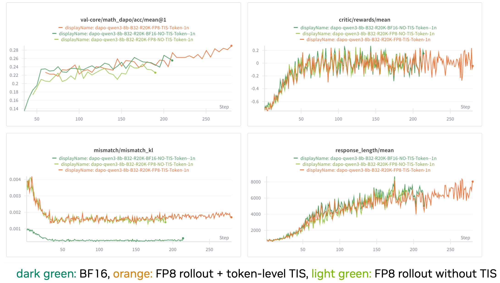
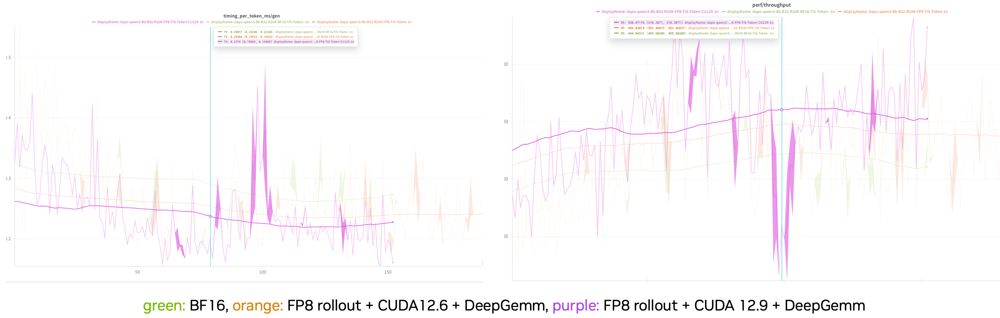
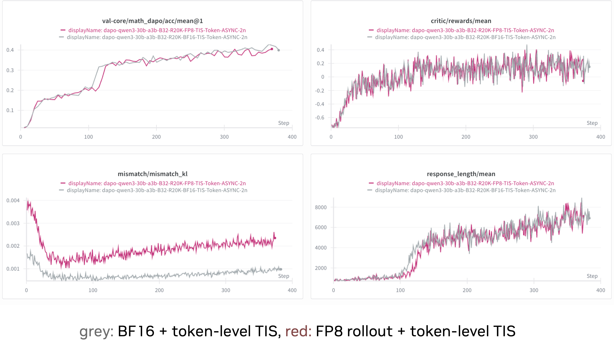
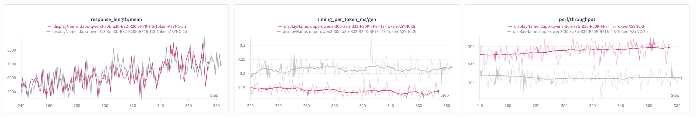
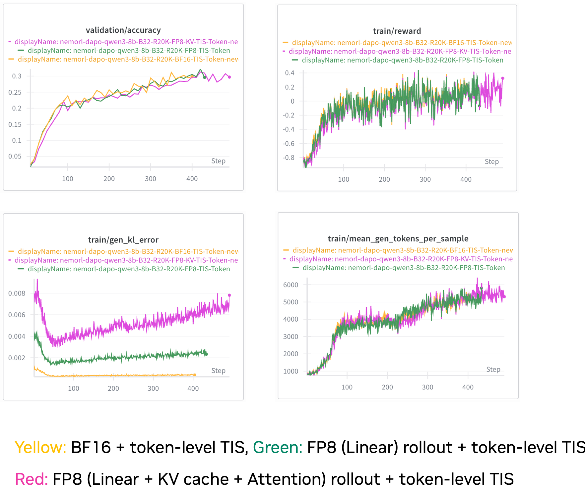
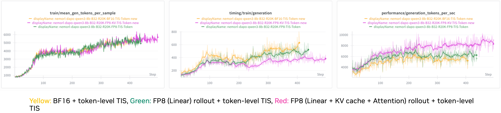
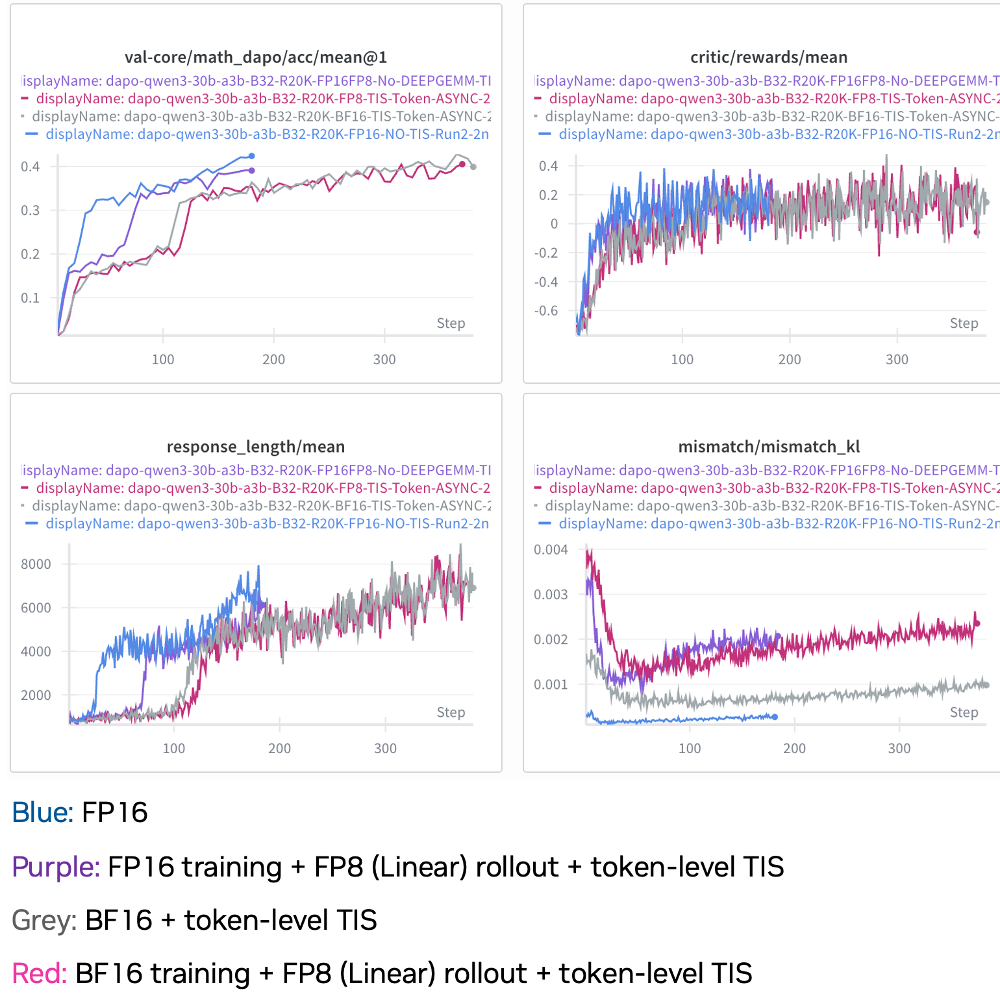
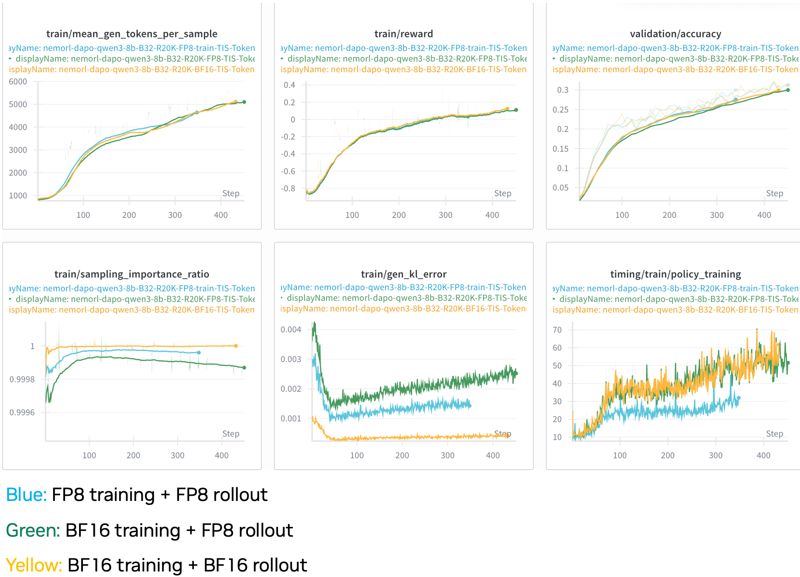

# Low Precision Reinforcement Learning (RL): Experiments and Analysis

This document summarizes the status, methodologies, and experimental results for implementing low-precision (FP8) techniques in RL workflows to optimize performance and memory efficiency.

## Overview and Status
* **Goal:** Implement FP8 rollout and training to improve efficiency in RL.
* **Current Support:** 
    * `verl`: FP8 rollout [PR](https://github.com/volcengine/verl/pull/3519) developed by us has been merged, supporting `vllm` 0.10.x/0.11, Batch/Async interfaces, and FSDP/Megatron backends.
    * `NeMo-RL`: FP8 KV cache and attention [PR](https://github.com/NVIDIA-NeMo/RL/pull/1212) developed by us is still under review.
* **Key Achievement:** Verified effectiveness of W8A8 blockwise quantization for rollout on Dense and MoE models.

---

## Experiment Settings

The common settings for all experiments are as follows:
* **Dataset:**
    * Training set: DAPO-17k
    * Validation set: AIME 24
* **Hyperparameters:**
    * Prompt Batch Size: 32.
    * Rollout Batch Size: $32 \times 3 \times 16$.
    * Train_batch_size & ppo_mini_batch_size: 32.
    * Max Response Length: 20K.

## Experiment 1: FP8 Rollout W8A8 (Dense Model)

This experiment evaluates the accuracy and performance impact of applying FP8 quantization (W8A8) during the rollout phase for a dense model.

### Configuration
* **Model:** Qwen3-8B-Base.
* **Hardware:** 8xH100
* **Framework:** veRL, vLLM + FSDP.
* **Hyperparameters:**
    * Correction: Token-level Truncated Importance Sampling (TIS), $C=2$.

### Results

* **Accuracy:** With TIS enabled, FP8 rollout validation accuracy aligns well with BF16. Without TIS, there is a significant accuracy drop.
* **Mismatch:** Higher mismatch KL divergence is observed compared to BF16 but remains within an acceptable range.

### Performance Analysis

* FP8 rollout leads to around **12%** rollout speedup with CUDA 12.6 + DeepGemm
* When enabled with CUDA 12.9, speedup can be up to **18%**.  

---

## Experiment 2: FP8 Rollout W8A8 (MoE Model)

This experiment extends the FP8 rollout evaluation to a Mixture-of-Experts (MoE) model, specifically Qwen3-30B-A3B-Base.

### Configuration
* **Model:** Qwen3-30B-A3B-Base.
* **Hardware:** $2 \times 8 \times H100$.
* **Framework:** veRL, Async Rollout mode, vLLM + FSDP.
* **Parallelism:** Tensor Parallelism ($TP$)=1, Expert Parallelism ($EP$)=1 (to reduce communication cost).
* **Correction:** Token-level TIS, $C=2$.

### Results

* **Mismatch:** 
    * Rollout and training distribution mismatch is generally higher for MoE models.
    * Rollout correction required even for BF16.
* **Accuracy:** 
    * However, FP8 rollout with token-level TIS successfully aligns with the BF16 baseline.

### Performance Analysis

*grey: BF16 + token-level TIS, red: FP8 rollout + token-level TIS​*

* **Throughput:** Achieved over **35%** rollout speedup.
* **Memory:** **49%** memory savings when loading model weights.
    * *BF16 Load:* ~56.8 GiB vs *FP8 Load:* ~29.0 GiB.
* **KV Cache & Concurrency:**
    * FP8 allows for a **3.2x larger KV cache**.
    * Max concurrency increased from **6.20x** (BF16) to **19.91x** (FP8).

---

## Experiment 3: FP8 KV Cache and Attention

This experiment tests the impact of enabling FP8 for the KV Cache and Attention layers, in addition to the Linear layers.

### Configuration
* **Model:** Qwen3-8B-Base.
* **Method:** Dynamically calculate qkv scales at the end of each training step and synchronize them to vLLM.
* **Framework:** NeMo-RL, vLLM + MCore, batch rollout mode.
* **Correction:** Token-level TIS, $C=2$.

### Results

* **Mismatch:** Enabling FP8 for KV cache and attention increases mismatch compared to using FP8 only for Linear layers. 
* **Accuracy:** Applying token-level TIS realigns the accuracy curve with BF16.

### Performance Analysis

* **KV Cache Capacity:** FP8 KV cache provides an additional **2x token capacity** and concurrency.
    * BF16: GPU KV cache size: 249,952 tokens, Maximum concurrency: 11.10x
    * FP8 Linear-only: GPU KV cache size: 299,344 tokens, Maximum concurrency: 13.29x
    * FP8 Linear + KV Cache: GPU KV cache size: 598,672 tokens, Maximum concurrency: 26.57x
* **Speedup:**
    * Adding FP8 KV cache/Attention yields an additional **~30% rollout speedup** over FP8 Linear only.
    * Total speedup compared to BF16 is approximately **48%**.
* **Observation:** Longer response lengths benefit more due to the higher portion of computation spent in attention.

---

## Experiment 4: FP16 + FP8 Rollout

This experiment investigates switching the training precision to FP16 while using FP8 for rollout to mitigate mismatch.

### Configuration
* **Model:** Qwen3-30B-A3B-Base.
* **Hardware:** $2 \times 8 \times H100$.
* **Framework:** veRL, Async Rollout mode, vLLM + FSDP.
* **Parallelism:** Tensor Parallelism ($TP$)=1, Expert Parallelism ($EP$)=1 (to reduce communication cost).

### Results and Analysis

* **Convergence:** 
    * FP16 converges faster than BF16, even without TIS enabled.
    * FP16 + FP8 even converges faster than BF16.
* **Mismatch:** 
    * The mismatch of FP16 + FP8 is not smaller than that of BF16 + FP8.
    * The gap between FP16 + FP8 and end2end FP16 is larger than the gap between BF16 + FP8 and end2end BF16.

---

## Experiment 5: FP8 End-to-End (Training + Rollout)

This experiment explores an end-to-end (E2E) FP8 pipeline, using FP8 for both the policy training and the rollout generation.

### Configuration
* **Model:** Qwen3-8B-Base.
* **Framework:** NeMo-RL, FP8 e2e (End-to-End), vLLM 0.11 + MCore + CUDA 12.9 + DeepGemm.
* **Correction:** Token-level TIS, $C=2$.

### Results and Analysis

* **Accuracy:** The accuracy curve of FP8 e2e aligns with BF16.
* **Mismatch:** FP8 e2e demonstrates **smaller mismatch** compared to using FP8 for rollout only.
* **Performance:** FP8 training achieves a **~20% speedup** compared to BF16 training.

<!-- ---

## Experiment 6: GRPO with TIS/MIS

### Configuration
* **Model:** Qwen3-8B-Base and Qwen3-30B-A3B.
* **Algorithm:** GRPO (Group Relative Policy Optimization).
* **Hyperparameters:** Prompt Batch Size 256, Max response length 16K.

### Results
* **Alignment:** The experiments compared "BF16 Train + BF16 Rollout," "FP8 Rollout + MIS," and "FP16 Rollout + TIS". All configurations showed consistent validation accuracy. -->
