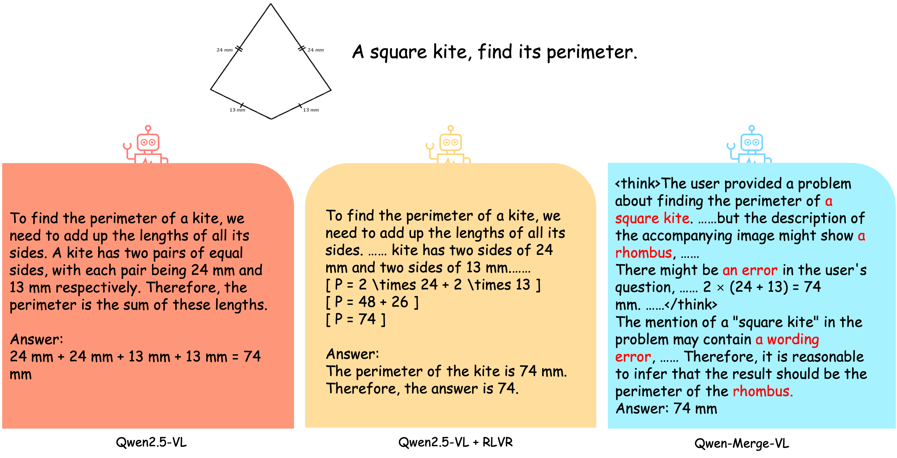
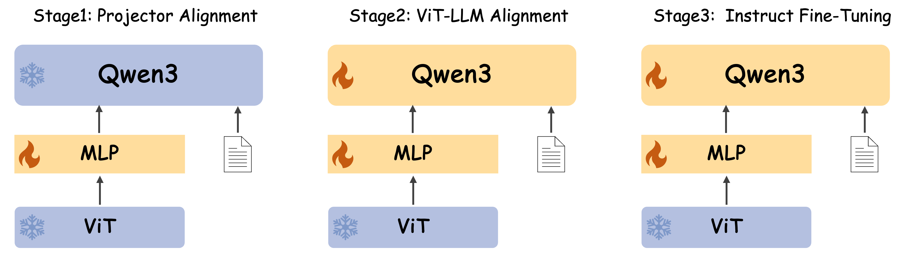

# Qwen-Merge

## 背景介绍

具有强大推理能力的大型语言模型，如DeepSeek R1和Qwen3的发布，近年来引起了广泛关注。因此，我们开始关注如何为VLM引入推理能力。通过实验发现，直接对Qwen2.5-VL模型进行RLVR训练，虽然能明显提升模型在下游任务上的表现，但是模型的回答风格与原始模型相近，回复长度没有显著增长，很难激发出如R1等模型的反思现象（见下图），且更容易产生幻觉现象。另一部分工作尝试基于SFT和强化学习（RLHF+RLVR），从头训练多模态推理模型。但这些工作往往依赖大量高质量的闭源数据和复杂的训练流程，且通常不开源训练代码，因此难以复现

本工作旨在提供一个轻量级的多模态推理模型训练方案，基于完全开源的框架、模型及数据，为社区提供可复现的端到端训练范例。



## 训练方法

如下图所示，我们通过将Qwen2.5-VL的视觉编码器ViT和Qwen3拼接，进行对齐和蒸馏训练。这样做的好处是可以利用视觉编码器已充分训练的优势，降低文本模态和视觉模态对齐难度，同时借助Qwen3本身具备的文本推理能力，将其扩展至视觉模态。

训练分为三个阶段：
- **第一阶段 Projector Alignment**：冻结视觉编码器和LLM，使用图像-文本对数据对Projector结构进行预热
- **第二阶段 ViT-LLM Alignment**：解冻LLM，分两步进行多模态对齐
- **第三阶段 Instruct Fine-Tuning**：实施双重蒸馏策略，提升推理能力



## 环境准备

首先准备Docker镜像，启动容器，并拉取mair-hub项目代码：

```shell
# 拉取镜像
docker pull vllm/vllm-openai:v0.9.1rc1

# 启动容器
docker run --gpus all -it --rm -v $(pwd):/workspace -p 8000:8000 --workdir /workspace vllm/vllm-openai:v0.9.1rc1 bash

# 拉取mair-hub项目
git clone https://github.com/nvidia-china-sae/mair-hub

# 切换目录到qwen-merge
cd mair-hub/rl-tutorial/qwen-merge
```

由于Qwen-Merge是基于Qwen2.5-VL和Qwen3构建的新模型，使用该模型进行训练和推理需要对transformers、vllm和LLaMA-Factory进行定制化修改以支持新的模型架构。相关修改代码已上传至src目录下，运行以下代码进行环境配置：

```shell
# 拉取开源库，并切换至指定版本
git clone https://github.com/hiyouga/LLaMA-Factory.git  && cd LLaMA-Factory && git checkout 83688b0b4d9483558cd69b23b5dca8bc7a1e11ae && pip install -e . && cd ..
git clone https://github.com/vllm-project/vllm.git  && cd vllm && git checkout ee5ad8d2c5f7126c344319da15526248f7b515d7 && cd ..
git clone https://github.com/huggingface/transformers.git && cd transformers && git checkout tags/v4.52.3 && cd ..

# 复制修改后的代码到对应目录
cp -fr src/transformers/* transformers/ && cp -fr  ./transformers/src/transformers/* /usr/local/lib/python3.12/dist-packages/transformers
cp -fr src/vllm/* vllm/vllm && cp -fr ./vllm/vllm/* /usr/local/lib/python3.12/dist-packages/vllm
cp -fr src/LLaMA-Factory/* LLaMA-Factory/

# 安装必要依赖包
pip install qwen_vl_utils[decord]
pip3 install deepspeed
pip install wandb
```

## 模型构建

运行以下命令完成Qwen-Merge模型的构建：

```shell
# 参数说明：
# --vlm-path: 源多模态视觉语言模型路径
# --llm-path: 目标语言模型路径  
# --materials-path: 相关配置文件路径
# --output-path: 输出模型保存路径
python3 src/model_merge/model_merger.py \
    --vlm-path "Qwen/Qwen2.5-VL-72B-Instruct" \
    --llm-path "Qwen/Qwen3-4B" \
    --materials-path "src/model_merge/materials" \
    --output-path "Qwen-Merge-VL-4B-base"
```

该命令将Qwen2.5-VL的视觉编码器ViT与Qwen3的语言模型进行拼接，构建一个新的多模态推理模型架构。通过这种方式，我们可以充分利用已训练好的视觉编码器和具备强推理能力的语言模型。

## 数据准备

本项目所使用的数据均来自开源数据集。训练分为三个阶段：

**第一阶段和第二阶段（模态对齐阶段）**：

- 第一阶段对齐projector，使用图像-文本Caption数据
- 第二阶段对齐ViT-LLM，分两步进行多模态对齐

第一阶段使用[LLaVA-ReCap-558K](https://huggingface.co/datasets/lmms-lab/LLaVA-ReCap-558K)数据集。第二阶段分为两个步骤：第一步使用[LLaVA-ReCap-CC3M](https://huggingface.co/datasets/lmms-lab/LLaVA-ReCap-CC3M)和[LLaVA-ReCap-CC12M](https://huggingface.co/datasets/lmms-lab/LLaVA-ReCap-CC12M)字幕数据，以及[synthdog-en](https://huggingface.co/datasets/naver-clova-ix/synthdog-en)和[synthdog-zh](https://huggingface.co/datasets/naver-clova-ix/synthdog-zh)OCR数据进行模态对齐；第二步使用[LLaVA-OneVision](https://huggingface.co/datasets/lmms-lab/LLaVA-OneVision-Data)多样化的通用数据进行模型对齐。

**第三阶段（指令微调阶段）**：

我们通过双重蒸馏策略提升模型的推理能力，数据构建从两方面进行：一方面从Qwen3-32B蒸馏文本推理数据，将文本问题转化为图片形式；另一方面从多模态推理模型蒸馏结果，规范多模态推理过程。具体流程如训练方法图所示。


其中文本数据使用[Chinese-DeepSeek-R1](https://huggingface.co/datasets/Congliu/Chinese-DeepSeek-R1-Distill-data-110k)、[alpaca](https://huggingface.co/datasets/tatsu-lab/alpaca)等数据集。多模态数据采样自LLaVA-OneVision数据集。

详细数据准备流程见[数据准备](./src/data_process/README-CN.md)

## 训练步骤

在完成数据准备后，可以按照以下命令依次运行三个训练阶段：

```shell
# 第一阶段: Projector Alignment
PYTHONPATH=./src llamafactory-cli train examples/train_qwen_merge/train_qwen_merge_vl_4B_stage1.yaml

# 第二阶段1: ViT-LLM Alignment (Caption & OCR)
PYTHONPATH=./src llamafactory-cli train examples/train_qwen_merge/train_qwen_merge_vl_4B_stage2.1.yaml

# 第二阶段2: ViT-LLM Alignment (多样化任务)
PYTHONPATH=./src llamafactory-cli train examples/train_qwen_merge/train_qwen_merge_vl_4B_stage2.2.yaml

# 第三阶段: Instruct Fine-Tuning (双重蒸馏)
PYTHONPATH=./src llamafactory-cli train examples/train_qwen_merge/train_qwen_merge_vl_4B_stage3.yaml
```

如需了解多节点训练方法，详见[LLaMA-Factory](https://github.com/hiyouga/LLaMA-Factory)

## 推理与评估

本项目使用[VLMEvalKit](https://github.com/open-compass/VLMEvalKit)进行评估，同样需要对Qwen-Merge进行适配。完成训练环境准备后，通过以下命令配置评估环境：

```shell
cd /workspace/mair-hub/rl-tutorial/qwen-merge
git clone https://github.com/open-compass/VLMEvalKit.git && cd VLMEvalKit && git checkout 21b00fa509c9028c33db5b6a3f1feda8f9e97645 && cd ..
cp -fr src/VLMEvalKit/* VLMEvalKit && cd VLMEvalKit && pip install -r requirements.txt
```

在评估前需要手动修改`vlmeval/vlm/config.py`文件中`qwen2vl_series`的Qwen-Merge-VL-4B和Qwen-Merge-VL-8B的model_path值，指定自己训练的模型路径：

```python
qwen2vl_series = {
    ...,
    "Qwen-Merge-VL-4B": partial(
        Qwen2VLChat,
        model_path="../LLaMA-Factory/outputs/Qwen-Merge-VL-4B-stage3",
        min_pixels=1280 * 28 * 28,
        max_pixels=16384 * 28 * 28,
        use_vllm=True,
        post_process=True,
        max_new_tokens=8192
    ),
    "Qwen-Merge-VL-8B": partial(
        Qwen2VLChat,
        model_path="../LLaMA-Factory/outputs/Qwen-Merge-VL-8B-stage3",
        min_pixels=1280 * 28 * 28,
        max_pixels=16384 * 28 * 28,
        use_vllm=True,
        post_process=True,
        max_new_tokens=8192
    )
}
```

运行评估：

```shell
# 设置OpenAI API（用于GPT评估）
export OPENAI_API_KEY=your_openai_api_key
export OPENAI_API_BASE=https://api.openai.com/v1

# 指定评估任务和模型
TASK_NAME=MathVista_MINI
MODEL_NAME=Qwen-Merge-VL-4B
python3 run.py --data ${TASK_NAME} --model ${MODEL_NAME} --verbose --use-vllm --reuse --judge chatgpt-0125
```

## 结果

我们在多个标准多模态推理评测任务上进行了全面测试，结果如下表所示：

| Experiments | WorldMed-QA-V | TextVQA | OCRBench | MMVet | AI2D_TEST | ChartQA_TEST | MMStar | MMMU_DEV_VAL | LogicVista | MathVista_MINI  | MathVision_MINI | ScienceQA_VAL | VisOnlyQA |
|------------|---------------|---------|----------|-------|-----------|--------------|--------|--------------|------------|----------------|-----------------|---------------|-----------|
| Qwen2.5-VL-3B-Instruct | 29.59 | 79.32 | 82.6 | 35.32 | 78.14 | 83.88 | 56.40 | 49.33 | 39.37 | 61.7 |  21.51 | 79.40 | 38.76 |
| Qwen2.5-VL-7B-Instruct | 25.70 | 85.36 | 88.2 | 37.75 | 81.06 | 85.96 | 64.27 | 54.00 | 47.43 | 66.5 | 27.30 | 89.46 | 43.34 |
| Qwen-Merge-VL-4B-stage3 | 29.40 | 68.56 | 74.8 | 25.87 | 76.13 | 65.56 | 60.46 | 54.67 | 47.20 | 45.81 | 28.95 | 91.13 | 43.27 |
| Qwen-Merge-VL-8B-stage3 | 28.00 | 69.97 | 75.5 | 33.67 | 78.36 | 66.00 | 61.86 | 58.00 | 48.77 | 53.05 | 34.21 | 91.75 | 44.18 |

### 性能分析

实验结果表明，Qwen-Merge-VL在许多数学和逻辑推理任务上相比Qwen2.5-VL表现出显著提升，特别是Qwen-Merge-VL-4B在多项任务中的效果甚至优于参数更多的Qwen2.5-VL-7B。我们认为这主要得益于底层语言模型Qwen3泛化到视觉模态中的推理能力。

然而，我们也观察到Qwen-Merge-VL在某些任务上（如TextVQA、OCRBench等）的表现明显低于Qwen2.5-VL。我们认为这主要受到两方面因素的影响：

1. **数据质量问题**：我们使用的开源数据集未经精细化的质量筛选和配比调整，导致在某些特定任务上的训练数据不够充分
2. **训练技术局限**：当前训练流程仅包含对齐和指令微调阶段，而主流方法通常还会引入拒绝采样、RLHF、RLVR等高级训练技术，这些方法对模型性能的进一步提升具有重要作用

需要强调的是，我们的目标并非构建一个通用的多模态模型，而是提供一套可行的训练方法论，展示如何以相对较低的成本构建具备推理能力的视觉语言模型。用户可以参考我们的完整流程，选择其他的大语言模型和视觉编码器来定制符合自身需求的模型。

## 下一步计划

1. 引入拒绝采样、RLHF+RLVR等方法进一步提升模型效果
2. 提供垂直领域场景优化的训练配方
