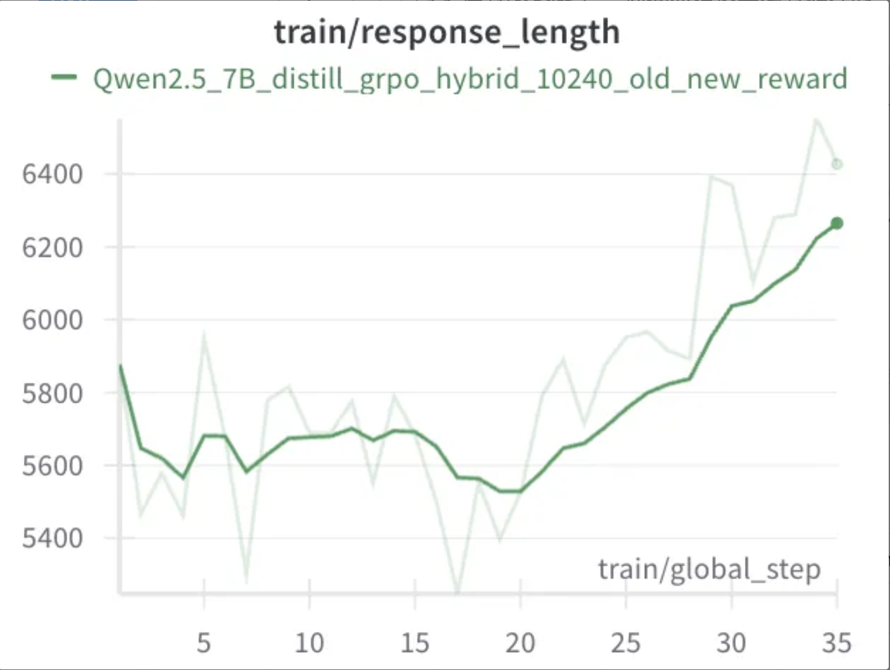
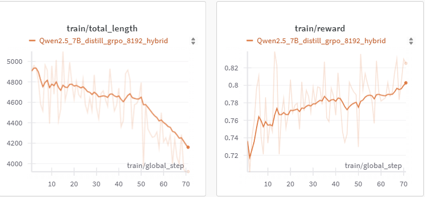
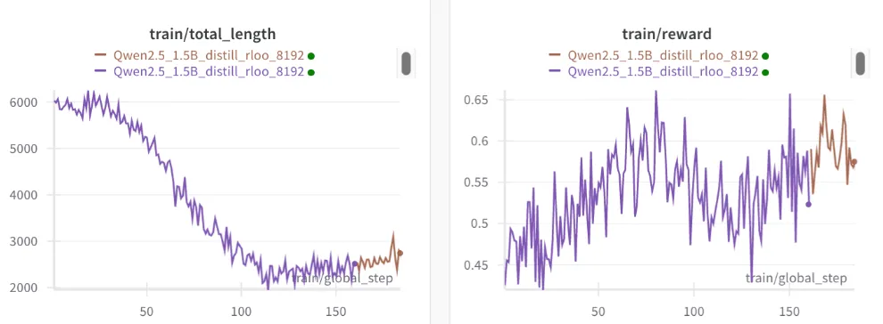

# RL Tutorial for R1-like Models

In this tutorial, we will reproduce the reinforcement learning training process of DeepSeek-R1 in the mathematics domain using the OpenRLHF framework (first performing SFT on the pretrained base model using Long-CoT data, then proceeding with RL). The content includes:

- [OpenRLHF Introduction](#openrlhf-introduction)
- [Data Preparation](#data-preparation)
- [Custom Reward Function](#custom-reward-function)
- [Launch Training](#launch-training)
- [Experimental Results](#experimental-results)
- [Ablation Studies](#ablation-studies)


## OpenRLHF Introduction

This section will provide a brief introduction to OpenRLHF installation and key parameters. If you are already familiar with OpenRLHF, you can skip directly to the "[Data Preparation](#data-preparation)" section.

### Environment Setup

Use the following commands to build a Docker container for launching OpenRLHF:

```bash
docker run --runtime=nvidia -it --rm --shm-size="10g" --cap-add=SYS_ADMIN -v $PWD:/openrlhf nvcr.io/nvidia/pytorch:24.07-py3 bash
sudo pip uninstall xgboost transformer_engine flash_attn pynvml -y

# Need to use vllm for inference acceleration
pip install openrlhf[vllm]

# Optional: for math tasks, install math-verify to validate mathematical answers
pip install math-verify==0.6.0
```

### Key Parameter Description

| Category | Parameter | Description |
|------|------|------|
| Basic | pretrain | Original model path, can be either a Huggingface path or local model file path |
| Basic | prompt_data | Training data path, can be either a Huggingface path or local data file path |
| Basic | input_key | The key corresponding to the prompt part in the data file |
| Basic | label_key | The key corresponding to the label part in the data file |
| Training Parameters | train_batch_size | Batch size used when updating actor parameters after rollout |
| Training Parameters | rollout_batch_size | Number of prompts consumed in each RL step during rollout phase |
| Training Parameters | n_samples_per_prompt | Number of responses generated for each prompt during rollout phase |
| Training Parameters | advantage_estimator | RL algorithm used, currently supports PPO, GRPO, Reinforce++, etc. |
| Training Parameters | num_episodes | Number of epochs to train on the entire training set |
| Training Parameters | init_kl_coef | KL coefficient |
| Training Parameters | temperature | Temperature coefficient needed when generating responses for prompts during rollout phase |
| Deployment Parameters | actor_num_nodes | Number of nodes for actor |
| Deployment Parameters | actor_num_gpus_per_node | Number of GPUs used per node for actor |
| Deployment Parameters | ref_num_nodes | Number of nodes for reference model |
| Deployment Parameters | ref_num_gpus_per_node | Number of GPUs used per node for reference model |
| Deployment Parameters | vllm_num_engines | Number of vLLM engines |
| Deployment Parameters | vllm_tensor_parallel_size | TP size for each vLLM engine |
| Deployment Parameters | vllm_gpu_memory_utilization | The proportion of the remaining GPU memory allocated for kv cache after other models have initialized when using vllm |
| Deployment Parameters | colocate_all_models | Whether to host all models (including vLLM engines) together, if so, they will share the same GPUs |
| Deployment Parameters | remote_rm_url | Reward model function or remote RM API |

> Note: Other common training parameters like lr, warmup are not detailed here, refer to later sections for specific settings

## Data Preparation

### Data Formats Supported by OpenRLHF

OpenRLHF provides multiple data processing methods and supports flexible data formats. Additionally, you can customize dataset classes, see details at: [OpenRLHF Dataset Classes](https://github.com/OpenRLHF/OpenRLHF/tree/main/openrlhf/datasets)

A simple example is as follows:

```python
def preprocess_data(data, input_template=None, input_key="input", apply_chat_template=None) -> str:
    if apply_chat_template:
        chat = data[input_key]
        if isinstance(chat, str):
            chat = [{"role": "user", "content": chat}]
        prompt = apply_chat_template(chat, tokenize=False, add_generation_prompt=True)
    else:
        prompt = data[input_key]
        if input_template:
            prompt = input_template.format(prompt)
    return prompt
```

OpenRLHF provides three different data processing methods:
1. Method One: Set the `--apply_chat_template` parameter to utilize the chat_template in Huggingface Tokenizer
2. Method Two: Use the `--input_template` parameter to use a custom template
3. Method Three: Pre-process the dataset offline and compose prompts according to custom formats

### Processing Training Data

This section uses Method Three as an example, pre-processing the dataset offline and composing prompts according to custom formats.

The dataset processing flow is as follows:

1. First, download the ORZ dataset to the local path [ORZ dataset](https://github.com/Open-Reasoner-Zero/Open-Reasoner-Zero/blob/main/data/orz_math_57k_collected.json)
2. Execute the script `python prepare_datast.py`

The core processing logic is as follows:

```python
user_prompt = """Please reason step by step, and put your final answer within \\boxed{}."""

tokenizer = AutoTokenizer.from_pretrained("deepseek-ai/DeepSeek-R1-Distill-Qwen-1.5B")

# Format Q&A pairs using Qwen's conversation template
messages = [
{"role": "user", "content": question + " " + user_prompt},
]

# Apply Qwen's conversation template
formatted_prompt = tokenizer.apply_chat_template(
    messages,
    tokenize=False,
    add_generation_prompt=True
)
```

*The Prompt Template used by DeepSeek-R1-Distill-Qwen series models is completely different from Qwen itself, please make sure to use DeepSeek-R1-Distill's Template*

The custom processed format is as follows:

```json
{
    "input": "Please reason step by step, and put your final answer within \\boxed{}.",
    "ground_truth_answer": "32"
},
```

Field descriptions:
- `input`: Model input content, including input template, prompt, and user question
- `ground_truth_answer`: Answer to the question

After preparing the dataset, set up in the launch script as follows:
```bash
--prompt_data <Your Data Name> \
--input_key input \ # Corresponds to input field
--label_key ground_truth_answer \ # Corresponds to answer field
```

## Custom Reward Function

OpenRLHF supports defining Reward functions by passing Python files, see the `--remote_rm_url` parameter for detailed usage. In this section, we use [r1_reward_func.py](./r1_reward_func.py) as the Reward function for mathematical experiments.

The main logic is:
1. The final reward consists of accuracy reward and length reward
2. Accuracy reward: Check if the generated answer matches the ground truth answer, reward is 1 if matched, 0 if not
3. Length reward: Add a positive reward for long and correct samples, add a negative reward for short and correct samples, to encourage the model to explore longer chains of reasoning
4. Considering that after distillation training, the model already has certain thinking abilities and can output correct formats. Therefore, in this section's Reward design, no format reward was added

## Launch Training
The training launch script is in [train_distill_7b_grpo_ray_hybrid_engine.sh](./train_distill_7b_grpo_ray_hybrid_engine.sh), readers can refer to this script for training.

```bash
ray start --head --node-ip-address 0.0.0.0 --num-gpus 8

sh train_distill_7b_grpo_ray_hybrid_engine.sh
```

## Experimental Results

### Training Curves


*Training curve for DeepSeek-Distill-7B*

### Experimental Evaluation

- DeepSeek-R1-Distill-Qwen-1.5/7B models already have reasoning abilities after distillation training, showing good performance in the initial stage.
- Through continued RL training, the model's reward can continue to increase.

| Dataset | AIME 2024 | GPQADiamond |
|--------|------|-------------|
| Qwen-distill-7B | 0.5167 | 0.5463 |
| step-30 | 0.5792 | 0.5463 |

- It was observed that through reward shaping, the model can be encouraged to generate longer chains of reasoning, with the model's reasoning chain length beginning to increase steadily after 20 steps.
- On AIME 2024, the model's improvement is very significant, even with Qwen-distill-7B already achieving 0.5167, it can further improve to 0.5792 (12%)

## Ablation Studies

In this section, we conducted some ablation experiments on key parameters for RL training.

### Reward Design

Analyzing the impact of reward shaping on final experimental results, the following experiment only uses accuracy_reward, without length reward



- Since the DeepSeek-R1-Distill-Qwen model can already output long reasoning chains after distillation, when response length = 10k, some long and correct samples will be truncated and get 0 points, causing the model to tend to shorten reasoning chain length.

### KL Loss

Analyzing the impact of kl loss values on final experimental effects, the following experiment uses kl=1e-2 (kl=0.0 in the above experiments)


- This experiment uses kl=1e-2, observing that response length quickly decreases and reasoning ability degrades.
- Conclusion: It is recommended to set a small kl value during RL training.

### Rollout Batch Size

Analyzing the impact of different rollout batch size settings on final experimental results.



- This experiment uses rollout batch size=64 (set to 256 in above experiments), the entire training process is more unstable with larger fluctuations.
- Both response length and reward convergence are poor.
- Conclusion: Large rollout batch size is important for the stability of the entire training process.