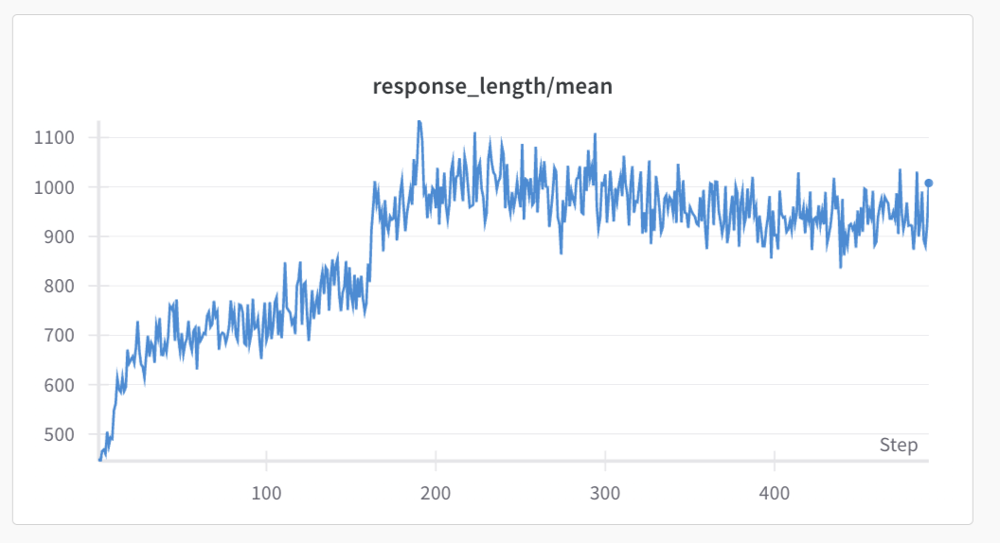

# R1-Zero 的 RL Tutorial

在本 Tutorial 中我们会使用 veRL 框架在数学领域来复现 DeepSeek-R1-Zero 的强化学习训练过程。内容包括了：

- [veRL 介绍](#veRL-介绍)
- [准备数据](#准备数据)
- [自定义 Reward function 和 Prompt Template](#自定义-reward-function-和-prompt-template)
- [启动训练](#启动训练)
- [实验曲线](#实验曲线)
- [评估实验](#评估实验)

## veRL 介绍

本节内容会对 veRL 的安装和关键参数进行简单介绍，如果读者对 veRL 非常熟悉可以直接跳转到 [准备数据](#准备数据) 章节。

### 准备环境

使用 veRL 官方提供镜像并使用下面的命令启动容器：

```bash
docker run --runtime=nvidia -it --rm --shm-size="10g" --cap-add=SYS_ADMIN \
 -v </path/need/to/mount>:</path/in/docker> \
 whatcanyousee/verl:vemlp-th2.4.0-cu124-vllm0.6.3-ray2.10-te2.0-megatron0.11.0-v0.0.6

# veRL已经支持了 vllm 0.8+ 的版本，可以使用下面的镜像启动
docker run --runtime=nvidia -it --rm --shm-size="10g" --cap-add=SYS_ADMIN \
 -v </path/need/to/mount>:</path/in/docker> \
 hiyouga/verl:ngc-th2.6.0-cu120-vllm0.8.2
```

登录容器后，安装 verl 和必要的依赖项

```bash
# install the nightly version (recommended)
git clone https://github.com/volcengine/verl && cd verl && pip3 install -e .

# 我们后续的实验是在数学任务上进行的，因此还需安装 math-verify 来作为奖励函数
pip install math-verify[antlr4_9_3]
```

> [!TIP]
> 1. 如果需要使用 wandb 来监控实验，需要 wandb login 来登录
> 2. 如果使用的 HuggingFace 数据集需要认证信息，则需要 huggingface-cli login 来登录 hf 账户

### 关键参数说明

| 类别 | 参数 | 说明 |
| --- | --- | --- |
| 基本参数 | actor_rollout_ref.model.path | 原始模型参数路径 |
| 基本参数 | data.train_files<br>data.val_files | 训练和验证数据路径。单路径如 data/orz/train.parquet，也支持传入多个路径如 "[data/orz/train.parquet,data/gsm/train.parquet]" |
| 训练参数 | trainer.total_epochs | 在整个训练集上训练的 epoch 数量 |
| 训练参数 | data.train_batch_size | 每个 RL step 消耗的 prompt 的数量 |
| 训练参数 | actor_rollout_ref.rollout.n | 在 rollout 阶段，为每个 prompt 生成多少个 responses。对于 GRPO 和 GLOO 必须要大于 1 |
| 训练参数 | actor_rollout_ref.rollout.temperature | 在 rollout 阶段，为prompt 生成 response 时所需的温度系数。值越大，则随机性越强。 |
| 训练参数 | actor_rollout_ref.actor.ppo_mini_batch_size | rollout 结束后，更新 actor 参数时的 batch_size，必须大于`data.train_batch_size` |
| 训练参数 | algorithm.adv_estimator | 使用的 RL 算法，目前支持 PPO、GRPO 等 |
| 训练参数 | algorithm.kl_ctrl.kl_coef | 计算 token level rewards 时的 KL 系数。原始 GRPO应该设为 0。 |
| GRPO 参数 | actor_rollout_ref.actor.use_kl_loss | 是否使用外置 KL loss。原始 GRPO 算法应该设为 True。 |
| GRPO 参数 | actor_rollout_ref.actor.kl_loss_coef | 外置 KL loss 前的系数。 |
| vllm 参数 | actor_rollout_ref.rollout.gpu_memory_utilization | The proportion of the remaining GPU memory allocated for kv cache after other models have initialized when using vllm. |
| vllm 参数 | actor_rollout_ref.rollout.tensor_model_parallel_size | rollout 阶段的 TP size，只对 vllm 生效 |

其余训练常用参数，如 lr、warmup 这里不详细说明，具体设置参考后面 2、3 章节

## 准备数据

### 数据格式

veRL默认只支持 parquet 格式文件，而且必须符合一定的格式要求。

veRL 中RLHF 阶段默认的每个样本的格式是如下所示：

```json
{
    "data_source": "pe-nlp/math-cl",
    "prompt": [
        {
            "role": "user",
            "content": question
        }
    ],
    "ability": "math",
    "reward_model": {
        "style": "rule",
        "ground_truth": solution
    },
    "extra_info": {
        'split': "train",
        'index': idx
    }
}
```

* data_source: 可以设定为样本的数据集名
* prompt: 是 list 形式的 chat messages。训练时框架会自动调用 tokenizer 的 apply_chat_template 来处理和 tokenize。
* ability：任务分类
* reward_model: 对于如 R1 的 RL 过程，我们设置为 rule-based reward function，并在 ground_truth 中传入问题答案。
* extra_info: 框架目前还没有用到

### 处理数据

我们要按照上面的格式为数据集写好对应的处理脚本，具体示例可以参考 veRL 官方的 [GSM8K 处理脚本](https://github.com/volcengine/verl/blob/main/examples/data_preprocess/gsm8k.py) 和 recipe 中的处理脚本 [train_dataset.py](./train_dataset.py) 。

我们需要在训练前提前运行处理脚本，将数据转为parquet 格式。

```bash
# 训练集
python train_dataset.py

# 验证集
python test_aime24.py
python test_math500.py
```

### 数据集说明

本 Tutorial 的训练集来自于 MATH 数据集和DeepScaler 数据集，对于两个数据集我们都使用 math-verify 过滤了无法校验答案的问题。

- MATH 数据集: 选取 Level 3-5 的 ～8.4k 个样本， 难度较低
- DeepScaler 数据集: 
    - 随机抽取 16k 的样本
    - 按照 Qwen2.5-7B-Instruct 为每个 prompt 生成8 个 response 并计算通过率
    - 过滤掉生成失败以及通过率为 1 的样本，剩余了 `12.7k` 的样本
    - 按照通过率将数据分为简单（通过率 > 65%）、中等（通过率 15%-65%）和困难（通过率 < 15%）三个分档

- 课程学习
    - 先在简单的 8K 数据上训练 2 个 episodes， 然后分别在简单、中等和困难子集上训练 1、15 和 20 个 episodes
    - 按照预设的 episodes 将数据集分别复制并按顺序拼接，生成最终的训练集 [pe-nlp/math-cl](https://huggingface.co/datasets/pe-nlp/math-cl)


## 自定义 Reward function 和 Prompt Template

### Reward function

最新的 veRL 已经支持了传入Python 文件的形式来定义 Reward function。 在本次实验中，我们使用 [math_reward.py](./math_reward.py) 来作为 Reward function。

其主要的逻辑为:
- 判断模型的输出是否符合 `<think>...</think>\s*<answer>...</answer>` 的格式，如果不符合返回 0
- 从 `<answer>...</answer>` 中提取出`boxed` 包裹的答案，如果不存在则返回 0
- 基于math-verify 来校验抽取的答案和 ground truth 的答案是否一致，如果一致返回 1，否则返回 0

### Prompt Template

参考 Open-Reasoner-Zero 论文，我们使用如下的 prompt template：

```python
(
    "A conversation between User and Assistant. The User asks a question, and the Assistant solves it. "
    "The Assistant first thinks about the reasoning process in the mind and then provides the User with the answer. "
    "The reasoning process and answer are enclosed within <think> </think> and <answer> </answer> tags, respectively, i.e., <think> reasoning process here </think> <answer> answer here </answer>. "
    "User: You must put your answer inside <answer> </answer> tags, i.e., <answer> answer here </answer>. "
    "{prompt}\n"
    "Assistant: <think>"
)
```

但是 veRL 目前的版本中仅支持tokenizer.apply_chat_template 来处理 prompt，因此需要修改这部分的代码：

首先，将 `r1_dataset.py` 放在 `verl/utils/dataset` 目录下。

然后，在 `verl/trainer/ppo/ray_trainer.py` 中导入 `R1Dataset`并替换 `RLHFDataset`。

```python
from verl.utils.dataset.r1_dataset import R1Dataset

...

def _create_dataloader(self):
    self.train_dataset = R1Dataset(....

    self.val_dataset = R1Dataset(...
```

## 启动训练

启动训练的脚本已经放在 [run_qwen2.5-7b.sh](./run_qwen2.5-7b.sh) 中，读者可以参考该脚本进行训练。

```bash
bash run_qwen2.5-7b.sh
```

## 实验曲线




 
- 模型在MATH数据集上只用了 100 step 就接近收敛，且 response length趋于稳定，但切换到第二份数据集的中等难度子集后，response length 会突然升高，但reward 会骤降
- 随着模型持续在中等和较难两个子集上持续训练，response length 最高接近 1100 ，并收敛于 1000 tokens 左右
- 在两个数据集上，在前期阶段，都有 response length 和 reward 同步提升的现象 (和 R1 论文的图在现象上一致)。但是在后期阶段 response length 开始稳定，reward 则还在提升。

## 评估实验

### 评估设置

我们选取了 3 个 广泛用于 reasoning model 评估的benchmark数据集，包括 AIME 2024 和 MATH 500 两个数学题数据集，以及 GPQA-Diamond 一个PhD-level 的物理、化学及生物等领域的数据集。

对于每个 prompt 我们生成 8 个 responses (temperature=0.6)，计算平均准确率即 Pass@1[8]. 具体的评估代码可以参考 [R1-Evaluation](https://github.com/zpqiu/R1-Evaluation)。

### 评估结果

|  | AIME 2024 | MATH 500 | GPQA-Diamond |
| --- | --- | --- | --- |
| Qwen2.5-7B | 4.58 | 59 | 30.38 |
| Qwen2.5-7B-Instruct | 12.08 | 77.12 | 41.5 |
| **Qwen2.5-7B-GRPO** | 17.92 | 78.75 | 38.37 |

- 经过 RL 学习后相比于 Base 模型提升非常显著，验证了基于 Base 模型仅仅依靠 outcome 和基于规则的 reward 函数的 RL 训练范式的有效性。
- RL 训练后的模型在OOD 的GPQA数据集（非数学题， 以化学、物理题等为主）也有提升，说明了其激活的推理能力是具有泛化性。
- RL 模型在 2 个 数学Benchmark 数据集上超过了 7B Instruct 模型，且在最难的 AIME 上提升明显。

### 反思行为分析

我们统计了在 3 个测试集上不同模型生成的 responses 中包含反思 token ("reevaluate", "reevaluation", "recheck", "rethink", "check again", "re-evaluate", "try again", "re-examine”)的比例

| Reflection Token 出现概率 | AIME 2024 | MATH 500 | GPQA-Diamond |
| --- | --- | --- | --- |
| Qwen2.5-7B | 4.16% | 0.6% | 2% |
| Qwen2.5-7B-Instruct | 5.41% | 0.75% | 1.25% |
| **Qwen2.5-7B-GRPO** | 11.67% | 4.5% | 9.50% |

可以看到:

- 原始的Base 和 Instruct模型也有一定比例的反思行为，而且在最难的 AIME 数据集上相对更加频繁
- 经过 RL 训练后，相比于 Base 模型，RL 模型在 3 个数据集上的反思行为明显增加，而且在 OOD 的 GPQA 上提升更加明显。


### Case Study

下面是一个 Case, 整个思考过程包括了 step by step、反思等行为。

<details>
<summary>点击查看</summary>

```latex
Question: If \\[\\sqrt[3]{2} = a + \\cfrac{1}{b + \\cfrac{1}{c + \\cfrac{1}{d + \\dotsb}}},\\] where $a,$ $b,$ $c,$ $d$ are positive integers, compute $b.$

<think>
To find the value of \( b \) in the continued fraction representation of \( \sqrt[3]{2} \), we start with the equation:

\[
\sqrt[3]{2} = a + \cfrac{1}{b + \cfrac{1}{c + \cfrac{1}{d + \dotsb}}}
\]

First, we need to determine the integer part \( a \) of \( \sqrt[3]{2} \). Since \( 1^3 = 1 \) and \( 2^3 = 8 \), it follows that \( 1 < \sqrt[3]{2} < 2 \). Therefore, \( a = 1 \). This allows us to write:

\[
\sqrt[3]{2} = 1 + \cfrac{1}{b + \cfrac{1}{c + \cfrac{1}{d + \dotsb}}}
\]

Next, we isolate the fractional part:

\[
\sqrt[3]{2} - 1 = \cfrac{1}{b + \cfrac{1}{c + \cfrac{1}{d + \dotsb}}}
\]

We need to find the value of \( b \). To do this, we approximate \( \sqrt[3]{2} - 1 \):

\[
\sqrt[3]{2} - 1 \approx 1.25992 - 1 = 0.25992
\]

We take the reciprocal of \( 0.25992 \):

\[
\frac{1}{0.25992} \approx 3.859
\]

Since \( b \) must be an integer, we take \( b = 3 \). This gives us:

\[
\sqrt[3]{2} - 1 \approx \frac{1}{3 + \cfrac{1}{c + \cfrac{1}{d + \dotsb}}}
\]

We now isolate the new fractional part:

\[
\sqrt[3]{2} - 1 - \frac{1}{3} = \frac{1}{c + \cfrac{1}{d + \cfrac{1}{e + \dotsb}}}
\]

Simplifying the left side:

\[
\sqrt[3]{2} - 1 - \frac{1}{3} = 0.25992 - 0.33333 = -0.07341
\]

Since we made an approximation, we need to recheck with more precision. However, the continued fraction approach suggests we should re-evaluate the integer part more accurately. Given the continued fraction representation, we can use the known result for \( \sqrt[3]{2} \):

\[
\sqrt[3]{2} = 1 + \cfrac{1}{3 + \cfrac{1}{3 + \cfrac{1}{3 + \cfrac{1}{3 + \dotsb}}}}
\]

This confirms that \( b = 3 \). Therefore, the value of \( b \) is:

\[
\boxed{3}
\]

</think> <answer> \boxed{3} </answer>
```
</details>