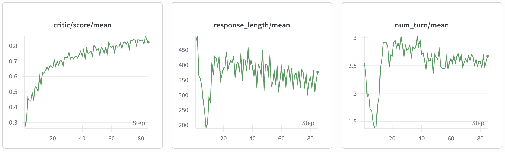
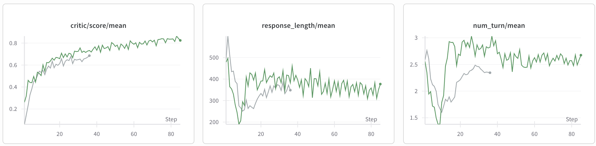
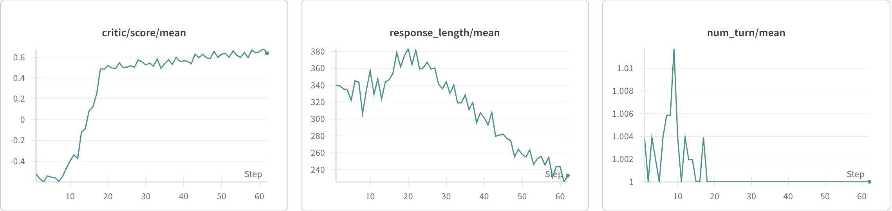

# Agentic RL - Text2SQL Tutorial

In this tutorial, we will introduce how to use the veRL framework for multi-turn reinforcement learning training to significantly improve model performance on Text2SQL tasks.

## 📋 Table of Contents

- [Task Introduction](#-task-introduction)
- [Code Configuration](#-code-configuration)
- [Data Preparation](#️-data-preparation)
- [Tool Definition](#-tool-definition)
  - [Tool Schema](#tool-schema)
  - [Tool Implementation Class](#tool-implementation-class)
- [Reward Function](#-reward-function)
- [Training](#-training)
  - [veRL Parameter Explanation](#verl-parameter-explanation)
  - [Starting Training](#starting-training)
  - [Training Curves](#training-curves)
  - [Example Cases](#example-cases)
- [Experimental Evaluation](#-experimental-evaluation)
  - [Environment Configuration](#environment-configuration)
  - [Evaluation Scripts](#evaluation-scripts)
- [Analysis](#-analysis)
  - [Adding Summary After Last Turn](#adding-summary-after-last-turn)
  - [Impact of Maximum Turns on Model Performance](#impact-of-maximum-turns-on-model-performance)
  - [Impact of Different Models on Performance](#impact-of-different-models-on-performance)
  - [Impact of Model Parameter Size on Performance](#impact-of-model-parameter-size-on-performance)

---

## 📖 Task Introduction

**Text2SQL** is a technology that automatically converts natural language text (such as Chinese or English question descriptions) into SQL query statements that can be executed in relational databases. The goal of this task is to enable users to retrieve and analyze complex database data using natural language in a conversational manner, greatly lowering the barrier to database operations and making data analysis more convenient and efficient.

### 🔄 Advantages of Multi-Turn Interaction

In practical applications, Text2SQL tasks can be not only single-turn (one input and one output) but also adopt **multi-turn dialogue** to complete complex queries. When the model is uncertain about user query intent or database structure, multi-turn interaction can:

- 🔍 **Explore Database Structure**: Generate exploratory SQL queries to obtain table structures, fields, or sample data
- ❓ **Confirm User Intent**: Ask follow-up questions about uncertain aspects
- ✅ **Automatic SQL Validation**: Automatically check the correctness and executability of generated statements through "SQL validation"
- 🔧 **Self-Correction**: Perform adaptive adjustments based on execution result feedback

This capability is particularly suitable for handling complex scenarios and open-ended query requirements, not only improving user experience but also significantly enhancing the application value of Text2SQL technology in actual business scenarios.

---

## 💻 Code Configuration
First, you need to download the veRL code from the specified commit.
```bash
git clone https://github.com/volcengine/verl
cd verl
# !IMPORTANT: checkout the commit, otherwise there may be incompatibility issues
git checkout 9d7cba4e1269d18565f1bcdba172c600db481c14
cd ..
```

After preparing the veRL code, run the following script to move the code to the specified locations:
```bash
sh mv_to_dest.sh
```

## 🗄️ Data Preparation

### 📥 Dataset Download

We use the [SkyRL-SQL-653-data](https://huggingface.co/datasets/NovaSky-AI/SkyRL-SQL-653-data) dataset, which contains 653 high-quality SQL datasets.

**Step 1: Download Main Dataset**
```bash
huggingface-cli download \
  --repo-type dataset \
  --resume-download \
  NovaSky-AI/SkyRL-SQL-653-data \
  --local-dir SkyRL-SQL-653-data \
  --local-dir-use-symlinks False
```

**Step 2: Download Database Files**
```bash
huggingface-cli download seeklhy/OmniSQL-datasets data.zip \
  --repo-type dataset \
  --local-dir <path_to_file.zip>
```

### ⚙️ Data Preprocessing

After downloading the dataset, execute the preprocessing script:

```bash
python recipe/text2sql/preprocess_sql_dataset.py \
  --input_file input_file_path \
  --local_dir output_file_path \
  --db_root_path path_to_OmniSQL_data
```

### 📝 Prompt Design

In the `preprocess_sql_dataset.py` file, we designed a specialized prompt with the following features:

1. **Multi-Turn Dialogue Generation**: Requires the model to generate in a multi-turn dialogue manner, first calling tools to explore the database, then generating the final answer when information is complete

2. **Structured Output Format**:
   - 💭 **Thinking Content**: Identified using `<think>` and `</think>` tags
   - 🔧 **Tool Calls**: Identified using `<tool_call>` and `</tool_call>` tags
   - 📊 **Tool Results**: Identified using `<tool_response>` and `</tool_response>` tags
   - 🎯 **Final Answer**: Identified using `<answer>` and `</answer>` tags

**System Prompt Definition:**
```python
DEFAULT_SYSTEM_CONTENT = (
    "You are a data science expert. Your task is to understand database schemas and generate valid SQL queries "
    "to answer natural language questions using SQLite database engine. You must conduct reasoning inside "
    "<think> and </think> blocks every time you get new information. After reasoning, you need to explore "
    "or verify database information, you can call a SQL execution tool by <tool_call> execute_sql </tool_call> "
    "and it will return the query results between <tool_response> and </tool_response>. "
    "You can execute SQL queries as many times as you want to explore the database structure and data. "
    "If you find no further exploration is needed, you MUST return your final SQL query enclosed within the <answer> </answer> tags."
)
```

---

## 🔧 Tool Definition

This section introduces how to configure new tools using the veRL framework, mainly including defining tool Schema and specific tool class implementation.

### Tool Schema

In veRL, you can use YAML files to define tools, including input and output field information. In `recipe/text2sql/config/tool_config/sql_tool_config.yaml`, we define the SQL execution tool:

```yaml
tools:
  - class_name: "verl.tools.sql_tool.SqlTool"
    config:
      # Database root path containing all dataset database files
      db_root_path: "/apps/data/OmniSQL-datasets/data/"
      
      # Concurrency control configuration
      num_workers: 60                    # Number of Ray workers
      rate_limit: 60                     # Maximum requests per second
      timeout: 30                        # SQL execution timeout (seconds)
      num_cpus: 32                       # Number of CPUs for parallel SQL execution
      type: native
      
      # Result truncation configuration
      max_result_chars: 9000             # Character count truncation for results
      max_result_rows: 50                # Row count truncation for results
      
      # Global rate limiting configuration
      enable_global_rate_limit: true     # Whether to enable global rate limiting
      
      # Logging configuration
      enable_logging: true               # Whether to enable execution logging
      log_dir: "/apps/logs/sql_execution" # Log storage directory
      
    tool_schema:
      type: function
      function:
        name: execute_sql
        description: Executes SQL queries and returns the results.
        parameters:
          type: object
          properties:
            sql_query:
              type: string
              description: "SQL query to be executed"
          required: 
            - sql_query
```

**Configuration Field Description:**

| Field | Description |
|-------|-------------|
| `class_name` | The specific location of the corresponding tool class, implementation will be introduced below |
| `config` | Configuration for tool execution, including database file path, concurrency control, logging configuration, etc. |
| `tool_schema` | Defines the input and output format of the `execute_sql` function |

### Tool Implementation Class

In `verl/tools/sql_tool.py`, we implement the specific tool class responsible for executing model-generated SQL and returning results.

---

## 🎯 Reward Function

This section introduces the reward function mechanism we defined for the Text2SQL task.

### 📊 Reward Rules

| Score | Condition | Description |
|-------|-----------|-------------|
| **-1** | Cannot parse content between `<answer>` `</answer>` from the last turn | Model failed to provide a valid final answer |
| **0** | Can parse SQL but execution error or inconsistent with ground truth answer | SQL syntax error or incorrect result |
| **1** | SQL executes correctly and is consistent with ground truth answer | Completely correct answer |

### 📁 Implementation Details

For specific implementation of the Text2SQL reward function, please refer to `recipe/text2sql/text2sql_reward_func.py`.

---

## 🚀 Training

### veRL Parameter Explanation

This section introduces key parameters related to multi-turn training in veRL:

| Parameter Name | Description |
|----------------|-------------|
| `actor_rollout_ref.rollout.name` | Specifies the name of this rollout, used to distinguish different training/evaluation configurations |
| `actor_rollout_ref.rollout.multi_turn.enable` | Whether to enable multi-turn dialogue mode. When set to `true`, the model will support multi-turn interaction, suitable for complex query scenarios |
| `actor_rollout_ref.rollout.multi_turn.max_assistant_turns` | Maximum number of consecutive replies the assistant can make in multi-turn dialogue. Used to control dialogue length and prevent infinite loops |
| `actor_rollout_ref.rollout.multi_turn.format` | Input-output format specification for multi-turn dialogue. Can be configured with different templates to adapt to different context organization methods |

### Starting Training

The training script is located in the `recipe/text2sql/run_qwen2.5-7b_text2sql.sh` file. You can refer to this script for training.

### Training Curves



Through training for 80 steps, we observed that model training converged:

- 📈 **Reward Improvement**: Model reward increased from 0.26 to around 0.85, with significant improvement in model generation accuracy on training samples
- 📏 **Response Length Stabilization**: Model-generated response length tends to stabilize. Since we use a non-reasoning model, the generation length is moderate
- 🔄 **Average Turns**: After convergence, the model needs an average of 2.5 turns to answer a question

### Example Cases

<details>
<summary>Case 1: For complex problems, the model breaks down the problem into several steps and solves them step by step.</summary>

#### **User Question**
> Find the names, ticker symbols, 1-year returns, and net expenses of the cream of the crop ETFs, those that are not only the top performers but also have the lowest fees, among the ones that are currently active.

---

#### **Turn 1 - Assistant Thinking and Action**

**🧠 Thinking Process:**
```
To achieve the task, we have to follow these steps:
1. Filter out ETFs that are currently active (is_active = 1).
2. Find the ETFs with the highest 1-year returns (return_1y).
3. For the ETFs found in step 2, find those with the lowest net expenses (net_expense).

First, let's identify ETFs that are currently active.
```

**🔧 Tool Call:**
```sql
SELECT etf_id FROM etf_overviews WHERE is_active = 1
```

**📊 Execution Result:**
```
 0
 0
 1
```

---

#### **Turn 2 - Assistant Analysis and Next Query**

**💭 Analysis:** Based on the first SQL query, we got two currently active ETFs with etf_id 0 and 1. Next, we need to find ETFs with the highest 1-year returns and lowest net expenses among these ETFs.

**🔧 Tool Call:**
```sql
SELECT MAX(return_1y) as max_return_1y, etf_id 
FROM etf_performance 
WHERE etf_id IN (0, 1) 
GROUP BY etf_id
```

**📊 Execution Result:**
```
   0  1
0.05  1
0.05  0
```

---

#### **Turn 3 - Further Fee Filtering**

**💭 Analysis:** ETFs with the highest 1-year returns (return_1y = 0.05) are both ETFs with etf_id 0 and 1. Therefore, we need to filter ETFs not only by the highest 1-year return but also by the lowest net_expense.

Let's check the lowest net_expense among ETFs that have a 1-year return of 0.05.

**🔧 Tool Call:**
```sql
SELECT MIN(net_expense) as min_net_expense, etf_id 
FROM etf_fees 
WHERE etf_id IN (0, 1) 
GROUP BY etf_id
```

**📊 Execution Result:**
```
   0  1
0.46  1
```

---

#### **Turn 4 - Generate Final Answer**

**💭 Analysis:** Among ETFs that have a 1-year return of 0.05, ETF with etf_id 1 has the lowest net_expense (0.46).

Based on this analysis, the cream of the crop ETF is the one with etf_id 1. Let's retrieve its name, ticker symbol, 1-year return, and net expense.

**🧠 Thinking Process:**
```
We need to join the relevant tables to retrieve the ETF's full information.
```

**🎯 Final Answer:**
```sql
SELECT eo.etf_name, eo.ticker, ep.return_1y, f.net_expense
FROM etf_overviews eo
JOIN etf_fees f ON eo.etf_id = f.etf_id
JOIN etf_performance ep ON eo.etf_id = ep.etf_id
WHERE eo.etf_id = 1 
  AND f.is_current = 1 
  AND ep.return_1y = (SELECT MAX(return_1y) FROM etf_performance WHERE etf_id = 1) 
  AND f.net_expense = (SELECT MIN(net_expense) FROM etf_fees WHERE etf_id = 1)
```

</details>

<details>
<summary>Case 2: For erroneous SQL, the model corrects based on feedback.</summary>

#### **User Question**
> Which sailors have the best performance (i.e., the lowest rank) in at least one race of each race type?

---

#### **Turn 1 - Initial SQL Query Attempt**

**🔧 Tool Call:**
```sql
SELECT s.name 
FROM sailors AS s 
JOIN boats AS b ON s.sailor_id = b.helm_id 
JOIN race_results AS rr ON b.boat_id = rr.boat_id 
GROUP BY s.name, rr.rank, rr.race_id, rr.race_type_id 
HAVING COUNT(DISTINCT rr.race_type_id) = (SELECT COUNT(DISTINCT race_type_id) FROM races) 
   AND rr.rank = (SELECT MIN(rank) FROM race_results 
                  WHERE race_id IN (SELECT race_id FROM races) 
                    AND boat_id IN (SELECT boat_id FROM boats WHERE helm_id = s.sailor_id))
```

**❌ Execution Result:**
```
Error executing SQL: no such column: rr.race_type_id
```

**💭 Error Analysis:** The race_results table does not have a race_type_id column, need to obtain this information through JOIN

---

#### **Turn 2 - Correct JOIN Relationship**

**🔧 Tool Call:**
```sql
SELECT s.name 
FROM sailors AS s 
JOIN (SELECT b.boat_id, rr.rank 
      FROM boats AS b 
      JOIN race_results AS rr ON b.boat_id = rr.boat_id) AS subq 
ON s.sailor_id = (SELECT helm_id FROM boats WHERE boat_id = subq.boat_id) 
GROUP BY s.name, subq.rank 
HAVING COUNT(DISTINCT (SELECT race_type_id FROM races WHERE race_id = subq.race_id)) = 
       (SELECT COUNT(DISTINCT race_type_id) FROM races) 
   AND subq.rank = (SELECT MIN(rank) FROM race_results 
                    WHERE race_id IN (SELECT race_id FROM races) 
                      AND boat_id IN (SELECT boat_id FROM boats WHERE helm_id = s.sailor_id))
```

**❌ Execution Result:**
```
Error executing SQL: no such column: subq.race_id
```

**💭 Error Analysis:** The subquery is missing the race_id field, need to include more necessary fields in the subquery

---

#### **Turn 3 - Perfect Subquery Structure**

**🔧 Tool Call:**
```sql
SELECT s.name 
FROM sailors AS s 
JOIN (SELECT b.boat_id, rr.rank, r.venue_id, rt.race_type_id 
      FROM boats AS b 
      JOIN race_results AS rr ON b.boat_id = rr.boat_id 
      JOIN races AS r ON rr.race_id = r.race_id 
      JOIN race_types AS rt ON r.race_type_id = rt.race_type_id) AS subq 
ON s.sailor_id = (SELECT helm_id FROM boats WHERE boat_id = subq.boat_id) 
GROUP BY s.name, subq.rank, subq.race_type_id 
HAVING COUNT(DISTINCT subq.race_type_id) = (SELECT COUNT(DISTINCT race_type_id) FROM races) 
   AND subq.rank = (SELECT MIN(rank) FROM race_results 
                    WHERE race_id IN (SELECT race_id FROM races) 
                      AND boat_id IN (SELECT boat_id FROM boats WHERE helm_id = s.sailor_id))
```

**✅ Execution Result:**
```
           0
Chris Webber
```

**💭 Success Analysis:** Successfully obtained the required data by correctly JOINing all relevant tables (boats, race_results, races, race_types)

---

#### **Turn 4 - Generate Final Answer**

**🎯 Final Answer:**
```sql
SELECT s.name 
FROM sailors AS s 
JOIN (SELECT b.boat_id, rr.rank, r.venue_id, rt.race_type_id 
      FROM boats AS b 
      JOIN race_results AS rr ON b.boat_id = rr.boat_id 
      JOIN races AS r ON rr.race_id = r.race_id 
      JOIN race_types AS rt ON r.race_type_id = rt.race_type_id) AS subq 
ON s.sailor_id = (SELECT helm_id FROM boats WHERE boat_id = subq.boat_id) 
GROUP BY s.name, subq.rank, subq.race_type_id 
HAVING COUNT(DISTINCT subq.race_type_id) = (SELECT COUNT(DISTINCT race_type_id) FROM races) 
   AND subq.rank = (SELECT MIN(rank) FROM race_results 
                    WHERE race_id IN (SELECT race_id FROM races) 
                      AND boat_id IN (SELECT boat_id FROM boats WHERE helm_id = s.sailor_id))
```

</details>

---

## 📊 Experimental Evaluation

This section introduces how to conduct experimental evaluation after model training.

### Environment Configuration

To conduct more accurate offline evaluation, we developed a complete evaluation environment. You can refer to the code in the `sql_eval` folder. This evaluation environment has the following features:

- ✅ **Environment Consistency**: The evaluation environment is completely consistent with the online training environment, avoiding online and offline differences
- 📋 **Trajectory-level Validation**: Supports trajectory-level validation analysis
- 🔄 **Multi-trajectory Sampling**: Supports sampling n trajectories for the same question for comparison

### Evaluation Scripts

**Step 1: Download Spider Test Set**

Dataset download link: https://yale-lily.github.io/spider

**Step 2: Start Inference Server**

First, you need to start an inference server based on the trained model:

```bash
python3 -m sglang.launch_server --model-path <model_path> \
  --host 0.0.0.0 \
  --port 30000 \
  --tp 4 \
  --tool-call-parser qwen25
```

**Step 3: Execute Evaluation**

Then, start evaluation with the following command:

```bash
python -m main_eval \
  --dataset_path spider_data/filter_test.json \
  --db_root_path spider_data \
  --sample_size 500 \            # How many data samples to evaluate
  --model_name <model_name> \
  --n 4                          # Sample n trajectories
```

---

## 📈 Analysis

### Analysis 1: Adding Summary After Last Turn

During model training, a maximum number of request turns is set. When the request turns reach the limit and no final reply is generated, the sample is treated as a negative example.

Considering that in online applications, for conversations that do not generate a final answer, the model is generally requested again to generate a final answer as much as possible. To ensure consistency between online applications and training, we added a **final summary** mechanism during training to summarize conversations that do not generate results and attempt to generate a final answer.

Training script reference: `recipe/text2sql/run_qwen2.5-7b_text2sql_final_summary.sh`

This script enables this functionality by setting `final_summary` to `true`.

| Model | Spider Test Set Accuracy |
|-------|--------------------------|
| qwen-2.5-7b-instruct | 0.618 |
| without summary | 0.646 |
| with summary | **0.674** |

**🔍 Conclusion:** By adding a summary mechanism during training, the model's performance on the test set improved significantly.

### Analysis 2: Impact of Maximum Turns on Model Performance

To verify the impact of maximum generation turns on model performance, we conducted a comparative experiment setting `max_assistant_turn` to 10 turns.



> In the figure, the gray line represents maximum turns set to 10, and the green line represents 6 turns.

Observations:
- More turns are not necessarily better
- For specific tasks, finding the most appropriate maximum generation turns is needed
- Too many turns may lead to reduced training efficiency without necessarily better results

### Analysis 3: Impact of Different Models on Performance

We compared the effects of **Qwen-2.5-7B-Instruct** and **Qwen-2.5-7B-Instruct-Coder** models.



Observations:
- Qwen-2.5-Instruct-Coder tends to give final answers directly in a single turn
- Qwen-2.5-7B-Instruct model performs better in multi-turn tasks

### Analysis 4: Impact of Model Parameter Size on Performance

We trained the **Qwen-2.5-14B-Instruct** model and evaluated it on the test set, comparing it with the 7B model.

| Model | Spider Test Set Accuracy | Improvement |
|-------|--------------------------|-------------|
| Qwen-2.5-7B-Instruct | 0.618 | - |
| Qwen-2.5-7B-Ours | 0.646 | +2.8% |
| Qwen-2.5-14B-Instruct | 0.678 | - |
| Qwen-2.5-14B-Ours | **0.788** | **+11.0%** |

Observations:
- After training, all models showed improvement on the test set
- **14B model showed more significant improvement** (11.0% vs 2.8%)
- Larger model parameter size provides stronger foundational capabilities for multi-turn reasoning

---

## Summary

Through this tutorial, we demonstrated how to use the veRL framework for multi-turn reinforcement learning training on Text2SQL. This work can provide valuable technical pathways and practical experience for real-world applications of Text2SQL tasks.

## Acknowledgement

This project is based on the comprehensive capabilities of the veRL framework and the contributions of the SkyRL team in Text2SQL datasets and technical solutions. It is precisely because of these open-source tools and community collaboration that research and practice in Text2SQL multi-turn reinforcement learning can proceed smoothly. Special thanks!