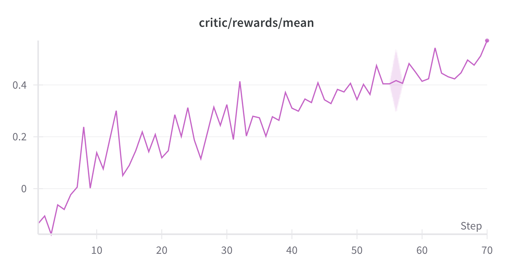
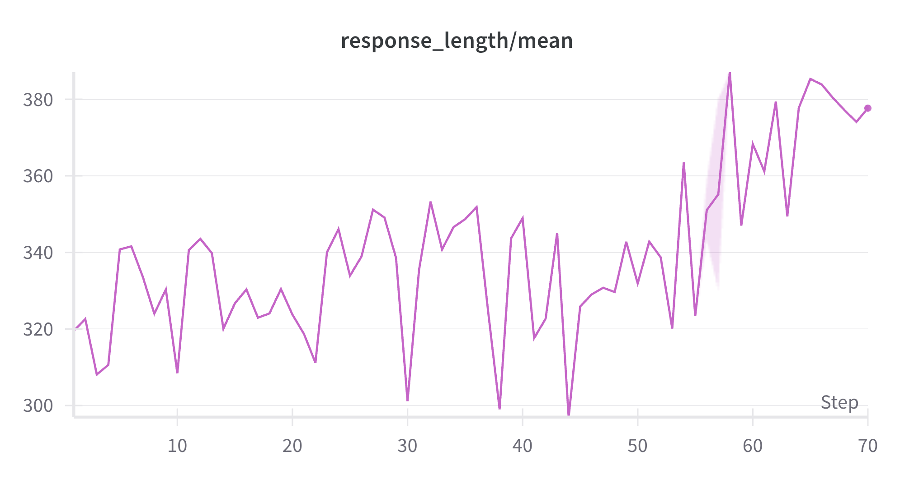

# VLM Reinforcement Learning (RL) Tutorial

This tutorial introduces how to use the veRL framework to train VLM models with reinforcement learning using text and multimodal data in the mathematics domain to enhance their reasoning capabilities. The main contents include:

- [Environment Setup](#environment-setup)
- [Data Preparation](#data-preparation)
- [Custom Reward Function and Prompt Template](#custom-reward-function-and-prompt-template)
- [Training](#training)
  - [Text Data Training](#text-data-training)
  - [Multimodal Data Training](#multimodal-data-training)
  - [Mixed Training](#mixed-training)
- [Experiment Curves](#experiment-curves)
- [Evaluation Experiments](#evaluation-experiments)

## Environment Setup

This section briefly introduces the installation method and key parameters of veRL. If you are already familiar with veRL, you can skip directly to the [Data Preparation](#data-preparation) section.

### Environment Preparation

Use the official veRL image and start the container with the following command:

```bash
# veRL now supports vllm 0.8+ versions, you can use the following image to start
docker run --runtime=nvidia -it --rm --shm-size="10g" --cap-add=SYS_ADMIN \
 -v </path/need/to/mount>:</path/in/docker> \
 hiyouga/verl:ngc-th2.6.0-cu120-vllm0.8.2
```

After logging into the container, install verl and necessary dependencies:

```bash
# install the recommended version
git clone https://github.com/volcengine/verl && cd verl && git checkout ee8c34749df90b88d00439a09a1f2acb51d71bc3 && pip3 install -e .

# If you need to use wandb to monitor experiments, you need to login with wandb
wandb login

# If you're using HuggingFace datasets that require authentication, you need to login to your hf account
huggingface-cli login
```

**After completing the veRL environment setup, please copy all files in this directory to the verl directory to ensure subsequent experiments can proceed normally.**


### Key Parameters

For key parameter descriptions of veRL, please refer to [Key Parameters](../r1-zero/README.md#key-parameters) in R1-Zero Tutorial.

## Data Preparation

### Data Format

veRL currently only supports data files in parquet format, and the data must meet specific structural requirements.

#### Text-Only Data Format
For text-only data (such as Skywork-OR1), the data format is similar but omits the images field, as shown below:

```json
{
    "data_source": "skywork/OR1",
    "prompt": [{
        "content": "Solve this algebra problem: If 3x + 7 = 16, what is the value of x?   You first think about the reasoning process as an internal monologue and then provide the user with the answer. Respond in the following format: <think>\n...\n</think>\n<answer>\n...\n</answer>", 
        "role": "user"
    }],
    "ability": "math",
    "reward_model": {
        "style": "rule",
        "ground_truth": "3"
    },
    "extra_info": {
        "index": 1,
        "split": "train",
        "answer": "3",
        "question": "Solve this algebra problem: If 3x + 7 = 16, what is the value of x?"
    }
}
```

#### Multimodal Data Format
In the RL phase of veRL, each multimodal sample should follow the data format below:

```json
{
    "data_source": "hiyouga/geometry3k",
    "prompt": [{
        "content": "<image>Find x. Round to the nearest tenth, if necessary. You first think about the reasoning process as an internal monologue and then provide the user with the answer. Respond in the following format: <think>\n...\n</think>\n<answer>\n...\n</answer>", 
        "role": "user"
    }],
    "images": [<PIL.PngImagePlugin.PngImageFile image mode=RGB size=622x406>], 
    "ability": "math",
    "reward_model": {
        "style": "rule",
        "ground_truth": "11"
    },
    "extra_info": {
        "split": "train",
        "index": 1,
        "answer": "11",
        "question": "<image>Find x. Round to the nearest tenth, if necessary."
    }
}
```

* data_source: Identifies the dataset source of the sample, facilitating data tracing and management.
* prompt: Chat messages stored in list form. During training, the framework will automatically call the tokenizer's apply_chat_template method to process and tokenize them.
* images: Image data stored in list form for multimodal data, with data type PIL.Image. The number of images must strictly correspond to the number of `<image>` tags in the prompt. In text-only data, this field should be completely omitted.
* ability: Describes the task type or ability domain involved in the sample.
* reward_model: In R1 stage RL training, it is recommended to use a rule-based reward function and fill in the standard answer to the question in the answer field.
* extra_info: This field is not currently directly used by the framework and can be left empty or customized according to actual needs.

### Data Processing

To ensure datasets conform to our predefined format specifications, raw data needs to be preprocessed and converted. You can execute the following script to complete the preprocessing of all datasets in one go:
```bash
bash process_all_datasets.sh
```

### Dataset Introduction

This tutorial uses two types of datasets for training:

#### Text Dataset
Text training uses the [Skywork-OR1-RL-Data](https://huggingface.co/datasets/Skywork/Skywork-OR1-RL-Data) dataset, a high-quality text-only dataset containing numerous mathematical task samples. Our experiments show that even training with text-only data can effectively improve the performance of multimodal models on visual tasks.

#### Multimodal Dataset
The multimodal training set uses [MMK12](https://huggingface.co/datasets/FanqingM/MMK12), which is a manually collected open-source multimodal reasoning dataset with a total of approximately 15K samples.


## Custom Reward Function and Prompt Template

### Reward Function

The latest version of veRL supports customizing reward functions by passing in Python files. In this experiment, we use [reward_model.py](./src/reward_model.py) as the reward function.

Its core logic is as follows:
- First, check if the model output conforms to the \<think\>...\</think\>\<answer\>...\</answer\> format; if not, return -1.0;
- Extract the answer from the \<answer\> tag, use rule-based matching to compare with the ground truth, and return 1.0 if the match is successful;
- If rule-based matching fails, call the reward model for answer verification; if the answer matches the standard answer, return 1.0, otherwise return -1.0.

### Prompt Template

The multimodal data has already concatenated the prompt with each sample's question. The prompt is as follows:

```python
You first think about the reasoning process as an internal monologue and then provide the user with the answer. Respond in the following format: <think>\n...\n</think>\n<answer>\n...\n</answer>.
```
The chat template defaults to using the model Tokenizer's Chat Template.

## Training

### Deploy Reward Model

Relying solely on mathematical rule-based verification as a reward function has obvious limitations, easily leading to false negative issues (i.e., correct answers being misjudged as incorrect by the reward function). To improve the accuracy of reward verification, it is recommended that users deploy appropriate reward models according to specific application scenarios. For example, [xVerify](https://github.com/IAAR-Shanghai/xVerify) is an answer verification tool specifically designed for evaluating reasoning models, capable of accurately extracting final answers and intelligently comparing the equivalence of mathematical expressions in different forms.

Users can deploy reward models using vLLM with the following example command:

```bash
# Set reward model service address and model path
export REWARD_MODEL_URL=http://<your_server_ip>:8888/v1
export REWARD_MODEL_PATH=<your_reward_model_path>
export REWARD_MODEL_NAME=<your_reward_model_name>
# Start reward model service (deployed with vLLM)
python3 -m vllm.entrypoints.openai.api_server \
  --model ${REWARD_MODEL_PATH} \
  --enable-chunked-prefill \
  --served-model-name ${REWARD_MODEL_NAME} \
  --max-model-len 8192 \
  --host 0.0.0.0 \
  --port 8888
```

**Note: Any third-party projects or artifacts you use are subject to applicable license terms and not licensed under MAIR-HUB.**

### Start RAY

For single-node training, start ray with the following command:
```bash
ray start --head --node-ip-address 0.0.0.0 --port=6379 --block 
```

For multi-node training, start ray with the following commands:
```bash
# Assuming there are multiple nodes
# Execute on the master node (MASTER_NODE_IP is the IP address of the master node)
ray start --head --node-ip-address=${MASTER_NODE_IP} --port=6379 --block 

# Execute on other nodes
ray start --address ${MASTER_NODE_IP}:6379 --block 
```

### Text Data Training

An interesting finding is that even when using only text data for reinforcement learning training, VLM models can achieve significant improvements in visual tasks. This indicates that the reasoning patterns and knowledge structures contained in text-only data can transfer to multimodal tasks.

Our experiments are based on the Qwen2.5-VL-7B-Instruct model, running in an environment with 8 GPUs on a single machine. When training with text-only datasets, execute the following command on the master node:

```bash
# Train with text-only data
bash run_qwen2.5-vl-7b-instrcut-text.sh
```

### Multimodal Data Training

The multimodal training command is similar to text training, as follows:

```bash
# Train with multimodal data
bash run_qwen2.5-vl-7b-instrcut-multimodal.sh
```

### Mixed Training

Experimental results show that combining text data with multimodal data for training can significantly improve the model's overall performance. This mixed training approach not only fully leverages the advantages of large-scale text data in reasoning and knowledge transfer, but also integrates the visual understanding capabilities brought by multimodal data, thus enabling the model to achieve improvements in both text understanding and visual reasoning.

It should be noted that currently VeRL does not support direct mixed training of text and multimodal data. To address this limitation, we added a blank image to text data samples to make their format consistent with multimodal data, thus achieving unified training of both types of data.


```
bash run_qwen2.5-vl-7b-instrcut-text-multimodal.sh
```

## Experiment Curves
The following figure shows the trend of reward values during training with mixed data. As training progresses, the reward value steadily increases, indicating that the model's ability in mathematical reasoning tasks is continuously strengthening:


The following figure shows the trend of model response length during training with mixed data. It can be observed that as training deepens, the model's response length increases somewhat.


## Evaluation Experiments

### Text Task Evaluation

For text task evaluation, we selected 3 benchmark datasets widely used for reasoning model evaluation:
- **AIME 2024**: American Mathematics Invitational Examination problem set, with high difficulty
- **MATH 500**: A comprehensive test set containing various mathematical problems
- **GPQA-Diamond**: Doctoral-level questions in physics, chemistry, and biology

The evaluation method adopts Pass@1[8], which generates 8 answers for each question (temperature=0.6) and calculates the average accuracy. Detailed evaluation code can be found in [R1-Evaluation](https://github.com/zpqiu/R1-Evaluation).


|  | AIME 2024 | MATH 500 | GPQA-Diamond |
| --- | --- | --- | --- |
| Qwen2.5-VL-7B-Instruct | 5.2 | 64.6 | 30.7 |
| Qwen2.5-VL-7B-Instruct-RL-Text | 6.9 | 68.0 | 35.5 |
| Qwen2.5-VL-7B-Instruct-RL-Multimodal | 5.0 | 66.3 | 33.7 |
| Qwen2.5-VL-7B-Instruct-RL-Text-Multimodal | 5.8 | 67.1 | 31.3 |
### Multimodal Task Evaluation

Multimodal evaluation covers various types of datasets:

- **Mathematics**: MMathVerse, MathVista
- **Comprehensive Abilities**: MME (Cognition and Perception)
- **Multi-dimensional Abilities**: MMStar (Science and Technology, Mathematics, Logical Reasoning, Instance Reasoning, Fine-grained Perception, Coarse-grained Perception)

The evaluation uses the **lmm-eval** framework, a comprehensive multimodal evaluation tool. An example evaluation command is as follows; for more usage, please refer to [lmms-eval](https://github.com/EvolvingLMMs-Lab/lmms-eval):

```bash
echo OPENAI_API_KEY: ${OPENAI_API_KEY}
echo HF_TOKEN: ${HF_TOKEN}
echo HF_HUB_ENABLE_HF_TRANSFER: ${HF_HUB_ENABLE_HF_TRANSFER}
chat_template="./qwen2vl.jinja" # Added the prompt used in training after the question
python3 -m lmms_eval \
    --model vllm \
    --model_args model_version=${model_path},enforce_eager=True,max_model_len=32768,threads=32,chat_template=${chat_template} \
    --tasks ${task} \
    --batch_size 64 \
    --log_samples \
    --log_samples_suffix vllm \
    --verbosity=DEBUG \
```
<table>
  <tr>
    <th> </th>
    <th style="text-align: center;">MMathVerse</th>
    <th style="text-align: center;">MathVista</th>
    <th colspan="2" style="text-align: center;">MME</th>
    <th style="text-align: center;">MMStar</th>
  </tr>
  <tr>
    <td> </td>
    <td style="text-align: center;">testmini</td>
    <td style="text-align: center;">testmini_format</td>
    <td style="text-align: center;">cognition</td>
    <td style="text-align: center;">perception</td>
    <td style="text-align: center;">average</td>
  </tr>
  </tr>
  <tr>
    <td> Qwen2.5-VL-7B-Instruct </td>
    <td style="text-align: center;">46.7</td>
    <td style="text-align: center;">56.0</td>
    <td style="text-align: center;">1484.1</td>
    <td style="text-align: center;">703.6</td>
    <td style="text-align: center;">62.9</td>
  </tr>
  <tr>
    <td> Qwen2.5-VL-7B-Instruct-RL-Text </td>
    <td style="text-align: center;">51.4</td>
    <td style="text-align: center;">68.0</td>
    <td style="text-align: center;">1573.7</td>
    <td style="text-align: center;">690.0</td>
    <td style="text-align: center;">64.6</td>
  </tr>
  <tr>
    <td> Qwen2.5-VL-7B-Instruct-RL-Multimodal </td>
    <td style="text-align: center;">51.5</td>
    <td style="text-align: center;">70.2</td>
    <td style="text-align: center;">1585.9</td>
    <td style="text-align: center;">454.0</td>
    <td style="text-align: center;">62.5</td>
  </tr>
  <tr>
    <td> Qwen2.5-VL-7B-Instruct-RL-Text-Multimodal </td>
    <td style="text-align: center;">51.8</td>
    <td style="text-align: center;">71.4</td>
    <td style="text-align: center;">1603.5</td>
    <td style="text-align: center;">606.4</td>
    <td style="text-align: center;">64.5</td>
  </tr>
</table>

### Conclusion
- Using only text data for reinforcement learning training can also achieve significant improvements in visual tasks.
- When performing reinforcement learning on multimodal data, the model's response length increases moderately, typically maintaining around 400-500 tokens.
- Mixed training can achieve the best results.

