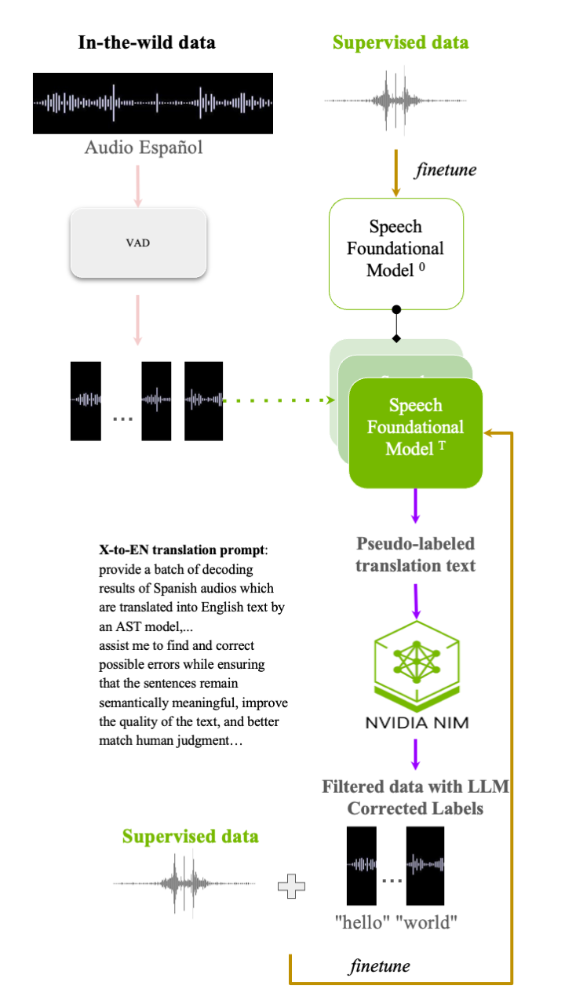

# Recipe of LESS: Large Language Model Enhanced Semi-Supervised Learning for Speech Foundational Model

This repository includes the recipe of how to finetune the Speech Foundational Model (SFM) with **L**arge Language Model **E**nhanced **S**emi-**S**upervised Learning (LESS) method.  

## General overview

Pipeline is illustrated in the below figure, taking the Spanish-to-English Automatic Speech Translation (ES-to-EN AST) as an example.  We have several steps: 

 1. Finetune the SFM at T=0 with supervised  data
 2. Prepare the unsupervised data 
 3. Generate the pseudo labels: inference the unsupervised using the initial SFM (SFM 0) to get the pseudo labels
 4. Perform LLM requests: Refine the pseudo labels with an LLM, and perform data filtering using proper **hypo_wer**
 5. New Finetune iteration: combine the supervised data and pseudo-labeled unsupervised data together, and finetune the SFM. Go step 3 and iterate until converge
 
<p align="center">
  
</p>

## Steps
In this section, we will go through each step of LESS in detail. We will use the open-source [Whisper Large-v3](https://huggingface.co/openai/whisper-large-v3) as our Speech Foundation Model in this tutorial. 

### Prepare the unsupervised data

#### Segment the audio
You can use your own collected data. As collected data may have long durations, we suggest to use a Voice Activity Detection module to segment the audio into shorter clips. In our paper, we use the open-source [Silera-VAD](https://github.com/snakers4/silero-vad). The input length of Whisper is restricted to 30 seconds, so you can set the maximum length of the VAD to 30 seconds or shorter to avoid non-acceptable inputs and more efficient GPU ussage. 

#### Data manifest format
The format of the training data manifest is shown below:
```
{"id": "aa", "recording_id": "aa", "start": 0, "duration": 2, "channel": 0, "text": "今天你吃了吗"}
```

#### Feature extraction
After preparing the wav data manifest, you can use the `compute_feat.py` script to extract the 80-dim FBANK that is desired input feature of Whisper Large-v3 model.
```
python3 
```

And you will get the generated features in the directory `data/fbank_whisper`. 

### Generate the pseudo labels
Then, we can start the inference of the unsupervised data to get their pseudo labels accordingly with the script `decode.py`.
```
python3 decode.py data/fbank_whisper
```

### Perform LLM requests
In our paper, we use NVIDIA [NIM](https://build.nvidia.com/) to process the LLM requests. NVIDIA NIM is a platform that supports optimized inference for the world’s leading models. 

We take `yi-large-34b`, the open-source Chinese LLM, as an example to help us correct our pseudo labels in the script `llm_rescore_zh.py`. You have to change the access token `API_KEY` in the script with your own ones.   
```
python3 llm_rescore_zh.py input_youtube.json output.json zh
```

After the LLM processing, we will get the response results in the `output.json` that contains the corrected text in the filed of `text`, the `hypo_wer` that compares the differences between the greedy decoding results and LLM corrected ones. 

#### Data filtering
In our paper, we find that using `hypo_wer` to filter data is efficient so we also suggest to select data with lower threshold like 0.1. 


### New Finetune iteration
To triger a new iteration of NST, here you have to combine the supervised data and filtered, unsupervised, LLM-corrected unsupervised data as the training input.
```
python3 train.py \
    --max-duration 60 \
    --exp-dir whisper/nst \
    --model-name large-v3 \
    --manifest-dir data/fbank_whisper \
    --num-epochs 5 \
    --deepspeed \
    --deepspeed_config ./whisper/ds_config_zero1.json
```

## Results
### Mandarin ASR 
Results in Word Error Rate, the lower the better.

| Model  | LESS | AISHELL1 | AISHELL2 | wenet_meeting |
| ------ | ---- | -------- | -------- | ------------- |
| Sup.   | -    | 2.86 | 5.26 | 17.65 |
| Iter 1 | N | 2.98 | 5.28 | 15.94 |
| Iter 1 | Y | 2.96 | 5.32 | 14.96 |
| Iter 2 | Y | 3.02 | 5.30 | 14.15 |
| Iter 3 | Y | 2.96 | 5.24 | 13.88 |
### Spanish-to-English AST
Results in Bleu scores, the higher the better.

| Model  | LESS | Callhome | Fisher |Common Voice |
| ------ | ---- | -------- | -------- | ------------- |
| Sup.   | -    | 33.5 | 64.2 | 36.7 |
| Iter 1 | N | 33.2 | 64.0 | 36.9 |
| Iter 1 | Y | 34.0 | 64.7 | 37.3 |
## Citation
``` bibtex
@misc{ding2025lesslargelanguagemodel,
      title={LESS: Large Language Model Enhanced Semi-Supervised Learning for Speech Foundational Models}, 
      author={Wen Ding and Fan Qian},
      year={2025},
      eprint={2506.04586},
      archivePrefix={arXiv},
      primaryClass={cs.CL},
      url={https://arxiv.org/abs/2506.04586}, 
}
